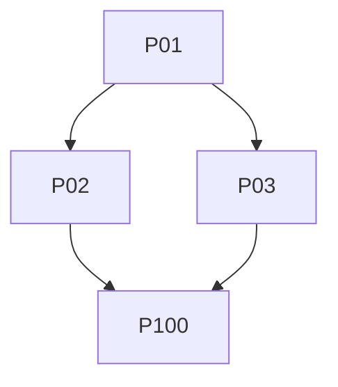

# 新規タブ自動キュー追加 実装計画

task_id: `T-20260827-auto-queue-new-tabs`

## Commander's Intent

設定が有効なとき、新規タブを `onCreated` 起点でキュー末尾へ一度だけ追加する。空タブは `storage.local` に保留し、後続の最初の通常URLを `onUpdated` で補完する。自動再生、既存タブの遡及追加、候補判定の拡張はしない。

## ★ Constants

| 定数 | 値 | 単位/用途 |
|---|---|---|
| `AUTO_QUEUE_NEW_TABS_KEY` | `autoQueueNewTabs` | sync key |
| `DEFAULT_AUTO_QUEUE_NEW_TABS` | `false` | 既定値 |
| `PENDING_AUTO_QUEUE_TAB_IDS_KEY` | `pendingAutoQueueTabIds` | local key |
| `QUEUE_INSERT_POSITION` | `end` | 挿入位置 |
| `QUEUE_AUTO_START` | `false` | 自動再生抑止 |
| `SETTINGS_EXPORT_VERSION` | `3` | export version |
| `PENDING_TTL` | `none` | TTLなし |
| `HOT_FILE_THRESHOLD` | `3` | compiler定数: 3 Process以上共有の変更ファイル |
| `ISOLATION_MIN_DIFF_LINES` | `80` | compiler定数: 単独隔離を要求する差分行数 |
| `MIN_PARALLEL_DIFF_LINES` | `20` | compiler定数: 並列化対象の最小差分行数 |
| `GATE_FORMAT` | `gate_id/phase/type/executor/required/command/input_scope/pass_criteria/evidence_spec/failure_policy/criterion_refs/policy_refs` | gate形式 |

## Scope

対象は設定・pending保存、オプションUI、export/import、`onCreated`/保留対象だけの`onUpdated`、`onRemoved`/`runtime.onStartup` cleanup、単一Promise列、関連テストである。既存候補判定、`TabManager.addTab`、既存の更新処理を再利用する。新権限、依存、`dist/`、prefetch仕様は変更しない。

## Assumptions

なし。以下で仕様を決定済みとする。

## Required Sections

本計画は Commander's Intent、Constants、Scope、15観点、Wave Map、Execution Contract、Conflict Matrix、Integration Gates、Acceptance、Docs、Don'ts、Risks、Final Gates、Verificationを含む。

## 15観点

1. 設定既定値: syncのboolean、欠損/読込障害はfalse。
2. pending契約: localの重複除去済み`number[]`、TTLなし。
3. 起点: 有効時の`onCreated`のみ。
4. URL確定: `pendingUrl ?? url`を採用。
5. 空/内部/不正URL: pending維持。
6. ignored: 最初の通常URLで候補外ならpending消費、追加なし。
7. 追加: 末尾1回、`autoStart:false`。
8. 重複: 既登録tabは再追加しない。
9. 更新: pending tabIdだけ補完処理。
10. 削除: `onRemoved`でpending削除。
11. 起動: `onStartup`でpendingを全消去し、ブラウザセッションをまたぐ`tabId`再利用を防ぐ。
12. 設定off: 新規処理を行わず既存キューを変更しない。
13. 直列化: 全イベントを単一Promise列へ投入し、失敗後も継続。
14. 転送: export version 3、boolean必須、旧欠損は現在値維持、API key除外。
15. 互換性: Chrome MV3 / Firefox MV2、追加権限なし。

## Progress / Wave Map

| Wave | Processes | Depends on Wave | Disjoint | Status |
|------|-----------|------------------|----------|--------|
| W01 | P01 | - | y | - [ ] planning |
| W02 | P02, P03 | W01 | y | - [ ] planning |
| W03 | P100 | W02 | y | - [ ] planning |

Wave凡例: 同一Wave内の Disjoint y のみ並列可。WaveはG_execのトポロジカル層の表示投影であり実行契約ではない。



## Generated Execution Graph

`plan-auto-queue-new-tabs/execution-graph.json` を正本とするコンパイラ出力。

```json
{
  "conflict_edges": [],
  "exec_nodes": [
    {"id": "P01", "depends_on": [], "est_diff_lines": 80, "isolation": false, "is_merge": false, "merges": [], "model": null, "core_path": "plan-auto-queue-new-tabs/process-01.md"},
    {"id": "P02", "depends_on": ["P01"], "est_diff_lines": 90, "isolation": false, "is_merge": false, "merges": [], "model": null, "core_path": "plan-auto-queue-new-tabs/process-02.md"},
    {"id": "P03", "depends_on": ["P01"], "est_diff_lines": 150, "isolation": false, "is_merge": false, "merges": [], "model": null, "core_path": "plan-auto-queue-new-tabs/process-03.md"},
    {"id": "P100", "depends_on": ["P02", "P03"], "est_diff_lines": 0, "isolation": false, "is_merge": false, "merges": [], "model": null, "core_path": "plan-auto-queue-new-tabs/process-100.md"}
  ],
  "merge_nodes": [],
  "wave_projection": [
    {"wave": "W01", "processes": ["P01"]},
    {"wave": "W02", "processes": ["P02", "P03"]},
    {"wave": "W03", "processes": ["P100"]}
  ]
}
```

## 根拠（Premises）

- PR-01: `src/background/index.ts:53` は既存のタブイベント配線位置。
- PR-02: `src/background/service.ts:954` は候補判定、`:986` は一括追加の既存流儀。
- PR-03: `src/background/tabManager.ts:240` はキュー追加、`:243` は既登録時の挙動。
- PR-04: `src/shared/utils/storage.ts:136` はsync設定保存パターン。
- PR-05: `src/options/hooks/useOptionsData.ts:34` は設定ロード集約点。
- PR-06: `src/options/OptionsApp.tsx:108` はcheckbox/保存失敗rollbackの類似実装。
- PR-07: `src/manifest/manifest.chrome.json:6`、`src/manifest/manifest.firefox.json:11` は既存権限。
- PR-08: [Chrome tabs API](https://developer.chrome.com/docs/extensions/reference/api/tabs) はcreated時URL未確定とupdated補完の根拠。
- PR-09: [Chrome service worker lifecycle](https://developer.chrome.com/docs/extensions/develop/concepts/service-workers/lifecycle) はメモリpendingを採用しない根拠。
- PR-10: [MDN storage.session](https://developer.mozilla.org/en-US/docs/Mozilla/Add-ons/WebExtensions/API/storage/session) は採用しない一時領域の比較根拠。

## Execution Contract

```yaml
schema_version: 3
task_id: T-20260827-auto-queue-new-tabs
premises:
  - {id: PR-01, ref: src/background/index.ts:53}
  - {id: PR-02, ref: src/background/service.ts:954}
  - {id: PR-03, ref: src/background/tabManager.ts:240}
  - {id: PR-04, ref: src/shared/utils/storage.ts:136}
  - {id: PR-05, ref: src/options/hooks/useOptionsData.ts:34}
  - {id: PR-06, ref: src/options/OptionsApp.tsx:108}
  - {id: PR-07, ref: src/manifest/manifest.chrome.json:6}
  - {id: PR-08, ref: https://developer.chrome.com/docs/extensions/reference/api/tabs}
  - {id: PR-09, ref: https://developer.chrome.com/docs/extensions/develop/concepts/service-workers/lifecycle}
  - {id: PR-10, ref: https://developer.mozilla.org/en-US/docs/Mozilla/Add-ons/WebExtensions/API/storage/session}
premise_refs: [PR-01, PR-02, PR-03, PR-04, PR-05, PR-06, PR-07, PR-08, PR-09, PR-10]
no_premise_reason: "仕様・対象ファイル・公式互換性根拠を全て固定済み"
policies: [TEST-RED, TEST-GREEN, QUALITY-01, SCOPE-01, SCOPE-03, DONT-01, DONT-03, MANUAL-01, COMPAT-01]
negative_control: "既存タブの再読込/通常遷移では自動追加されない"
required_gates: [P01-VG-01, P01-VG-02, P01-VG-03, P02-VG-01, P02-VG-02, P02-VG-03, P03-VG-01, P03-VG-02, P03-VG-03, P100-VG-01, P100-VG-02, P100-VG-03, P100-VG-04]
processes: [P01, P02, P03, P100]
```

## Process Contract

- P01: `STORAGE_KEYS`、既定値、sync getter/setter、local pending getter/setter。Red→Green→Refactor。
- P02: `useOptionsData`、`OptionsApp`、転送サービス。checkbox、rollback、version 3、旧欠損保持。
- P03: `AutoQueueManager`とイベント配線。pendingはlocal永続化し、失敗時は保留維持、Promise列は継続。
- P100: 対象Jest→typecheck/lint/両ビルド→全テスト→実機Chrome/Firefox。

各Processの詳細・12列gate・GoalEvidenceは `plan-auto-queue-new-tabs/process-{01,02,03,100}.md` を正本とする。

## Conflict Matrix

| 競合 | 優先契約 | 解決 |
|---|---|---|
| `onCreated`と`onUpdated` | 起点/補完 | pending tabIdだけ更新処理 |
| createとremove | Promise列順 | 後から到着したイベントを順に適用 |
| add失敗と保留消費 | データ保全 | 消費せず列だけ継続 |
| offと既存キュー | 設定 | 新規処理のみ停止、既存キュー不変 |
| 新version不正と旧欠損 | 転送互換 | version 3は拒否、旧欠損は現在値維持 |

## Integration Gates

P01→P02/P03→P100のDAGを厳守する。P100-VG-01は責務横断Jest、P100-VG-02は型検査・lint・Chrome/Firefoxビルド、P100-VG-03は全テスト、P100-VG-04は両ブラウザー手動確認とする。全gateは証拠引用必須。

## Acceptance

AC-01 既定値false。AC-02 UI保存/rollback。AC-03 export version 3 boolean必須。AC-04旧欠損保持/API key除外。AC-05通常URLの新規タブを末尾へ一度だけ追加。AC-06空タブを後続通常URLで補完。AC-07 ignoredはpending消費のみ。AC-08空/内部/不正URLは保留。AC-09 onRemoved/off/startup cleanup。AC-10重複・順序不変。AC-11単一Promise列と失敗後継続。AC-12既存更新処理維持。AC-13 Chrome MV3/Firefox MV2。AC-14追加権限・依存・prefetch変更なし。

## Docs

要件正本は [`docs/requirements/auto-queue-new-tabs.md`](docs/requirements/auto-queue-new-tabs.md)。実装者はProcess本文、レビュー者は本計画と要件文書、検証担当はP100とevidence harnessを読む。

## Don'ts

既存タブ遡及追加、自動再生、candidate semantics拡張、新権限、TTL、`storage.session`採用、既存prefetch変更、`dist/`コミット、API key export、別Promise列、仕様外のUI/設定を追加しない。

## Risks

- サービスワーカー停止中もpendingを失わないためlocal保存する。
- tabId再利用を防ぐためstartupで現存タブ照合する。
- storage/add失敗時の消費先行はデータ損失になるため禁止する。
- Firefoxのイベント順序差はP100実機で確認し、差異があれば実装不備/互換差異に分類する。

## Final Gates

必須gate全件、`git diff --check`、行数、JSON parse、shell構文、gate参照整合、公式リンク到達が合格であること。手動gate未実施は完了扱いにしない。

## Verification

計画成果物の静的確認:

```sh
wc -l PLAN-auto-queue-new-tabs.md docs/requirements/auto-queue-new-tabs.md
node -e "JSON.parse(require('fs').readFileSync('plan-auto-queue-new-tabs/processes.ir.json','utf8'))"
for f in plan-auto-queue-new-tabs/evidence/*.sh; do bash -n "$f"; done
plan-auto-queue-new-tabs/evidence/verify-evidence.sh
git diff --check
```

実装後の機能確認はP100のコマンド列と手動確認記録を使用する。
