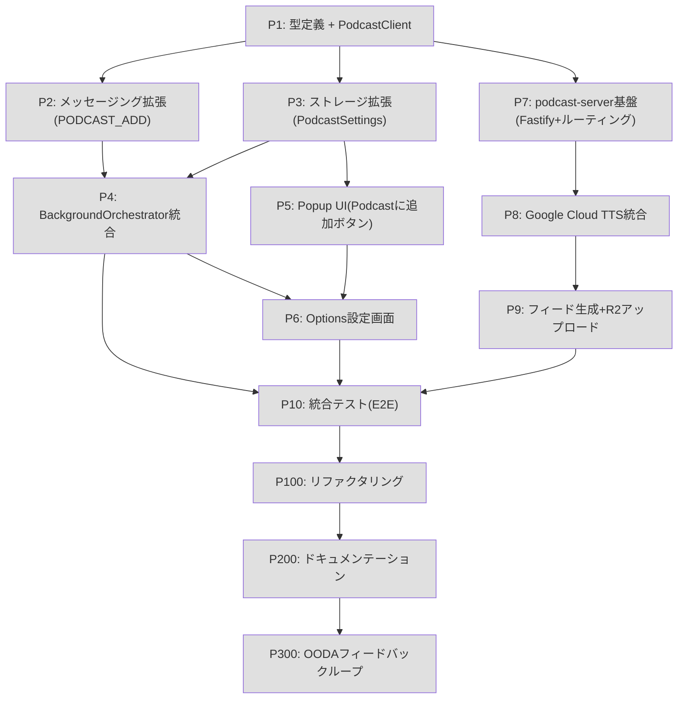

---
# === Mission Identity ===
mission_id: podcast-feed-generation-firefox
title: "Podcast音声フィード生成機能の実装（Firefox版優先）"
status: planning  # planning | in_progress | completed | blocked | failed
progress: 0       # 0-100
phase: planning   # planning | observe | orient | decide | act | feedback | completed

# === TDD Configuration ===
tdd_mode: true
tdd_phase: null   # red | green | refactor

# === OODA Configuration ===
ooda_config:
  enabled: true
  feedback_channels:
    immediate: true
    task: true
    mission: true
    cross: true

# === Execution Configuration ===
execution_mode: dag_executor
dag_config:
  enabled: true
  max_concurrent: 3
  cascade_failure: true
  visualization: true

# === Deliberation Configuration ===
deliberation:
  enabled: true
  level: auto
  multi_llm: false

# === Context Policy ===
context_policy:
  max_summary_tokens: 500
  detailed_log_path: "stigmergy/doctrine-logs/podcast-feed-generation-firefox/"
  aggregation_strategy: progressive_summarization

# === Session Continuity ===
session_continuity:
  continue_mode: true
  previous_mission_id: null
  project_path: "/home/takets/repos/read-aloud-tab"

# === Timestamps ===
created_at: "2026-03-01"
updated_at: "2026-03-01"
blockers: 0
---

# Commander's Intent

## Purpose
ブラウザ拡張の「Read Aloud Tab」から、記事コンテンツをローカルPodcastサーバーに投稿し、Google Cloud TTSで音声化したMP3をRSSフィードで配信することで、外出中のスマートフォンでも読みかけ記事を聴けるようにする。Firefox版を優先し、既存のPC側読み上げ機能を一切破壊しない。

## End State
- Firefox拡張のPopupに「Podcastに追加」ボタンが表示される
- ボタン押下でローカルサーバー（localhost:3456）にPOSTされ、Google Cloud TTSによるMP3生成が非同期実行される
- RSSフィード（feed.xml）をPodcastアプリに登録すると、生成済みエピソードを購読できる
- 既存の全テスト（447件以上）が引き続きパスする

## Key Tasks
- P1: Podcast型定義（`src/shared/types/podcast.ts`）とPodcastClient（`src/shared/services/podcastClient.ts`）の作成
- P7-P9: `podcast-server/` ディレクトリにNode.js/Fastify + Google Cloud TTS + RSSフィード生成サーバーを構築
- P3-P6: 拡張機能側（messages, storage, background service, popup UI, options）への統合

## Constraints
- Chrome対応はこのPLANのスコープ外（別PLAN）
- 既存PC読み上げ機能（TabManager, TTS Engine, Offscreen, Prefetch）を変更しない
- 機密情報（.env, Google Cloud認証キー）をコミットしない
- main/masterへの直接プッシュ禁止

## Restraints
- TDDを厳守（Red → Green → Refactor）
- Firefox用 `manifest.firefox.json` の `host_permissions` に `http://localhost:3456/*` を追加すること
- PodcastClientはOpenRouterClientと同じHTTPクライアントパターンに従うこと
- podcast-serverは独立したNode.jsサブパッケージとして構成すること
- ストレージ変更はマイグレーションガードを実装し、既存データを壊さないこと

---

# Context

## 概要
- ブラウザで読み途中の記事タブを「Podcastに追加」ボタンで投稿すると、ローカルサーバーがGoogle Cloud TTSで音声化し、RSSフィードを更新する
- ユーザーはPodcastアプリ（Overcast, Pocket Castsなど）にフィードURLを登録し、外出時にスマートフォンで続きを聴ける

## 必須のルール
- 必ず `CLAUDE.md` を参照し、ルールを守ること
- 不明な点はAskUserQuestionで確認すること
- **TDD（テスト駆動開発）を厳守すること**
  - 各プロセスは必ずテストファーストで開始する（Red → Green → Refactor）
  - テストクラスのdocblockには目的とテスト観点を記載すること
  - 実装コードを書く前に、失敗するテストを先に作成する
  - テストが通過するまで修正とテスト実行を繰り返す
  - プロセス完了の条件：該当するすべてのテスト、フォーマッタ、Linterが通過していること
  - プロセス完了後、チェックボックスを✅に変更すること

## 開発のゴール
- 外出中でも記事を音声で聴けるPodcastフィードをローカルで自動生成する
- 拡張機能の既存機能を維持しつつ、最小変更でPodcast投稿機能を追加する

## 費用目標
- Google Cloud TTS: 月72万文字以内 = 無料枠
- Cloudflare R2: 10GB/月 = 無料枠
- 合計: $0/月

---

# References

| @ref | @target | @test |
|------|---------|-------|
| `src/shared/services/openrouter.ts` | `src/shared/services/podcastClient.ts` | `src/shared/services/__tests__/podcastClient.test.ts` |
| `src/shared/types/ai.ts` | `src/shared/types/podcast.ts` | `src/shared/types/__tests__/podcast.test.ts` |
| `src/shared/utils/storage.ts`（getAiSettings パターン） | `src/shared/utils/storage.ts`（getPodcastSettings 追加） | `src/shared/utils/__tests__/storage.test.ts` |
| `src/shared/messages.ts`（QueueCommandMessage union） | `src/shared/messages.ts`（PODCAST_ADD 追加） | 既存 messages テスト拡張 |
| `src/background/service.ts`（processCommand / handleAddCommand） | `src/background/service.ts`（handlePodcastAdd 追加） | `src/background/__tests__/service.test.ts` |
| `src/popup/components/App.tsx`（actions-row, handleAddCurrentTab） | `src/popup/components/App.tsx`（「Podcastに追加」ボタン追加） | `src/popup/components/__tests__/App.test.tsx` |
| `src/popup/hooks/useTabQueue.ts`（UseTabQueueResult） | `src/popup/hooks/useTabQueue.ts`（addToPodcast 追加） | `src/popup/hooks/__tests__/useTabQueue.test.tsx` |
| `src/options/OptionsApp.tsx`（AI設定セクション） | `src/options/OptionsApp.tsx` または新規 `PodcastSettings.tsx` | `src/options/__tests__/OptionsApp.test.tsx` |
| `src/manifest/manifest.firefox.json` | `src/manifest/manifest.firefox.json`（host_permissions 追加） | 手動確認 |

---

# DAG Execution（並列タスク管理）

**有効化**: `--use-dag` オプション

## DAG Configuration

| Setting | Value | Description |
|---------|-------|-------------|
| enabled | true | DAG 実行の有効化 |
| max_concurrent | 3 | 最大同時実行タスク数 |
| cascade_failure | true | 失敗時に依存タスクをスキップ |
| partial_execution | true | 部分実行を許可 |
| visualization | true | Mermaid 可視化出力 |

## Task Dependencies Graph



## Parallel Groups

| Group | Tasks | Dependencies | Can Run Parallel |
|-------|-------|--------------|------------------|
| G1 | P1 | none | Yes（単独） |
| G2 | P2, P3, P7 | P1 | Yes（P1完了後、3並列可） |
| G3 | P4, P5, P8 | P2+P3, P3, P7 | 部分並列（P4はP2+P3待ち、P5はP3待ち、P8はP7待ち） |
| G4 | P6, P9 | P4+P5, P8 | 部分並列 |
| G5 | P10 | P4+P6+P9 | No（全完了待ち） |
| G6 | P100 | P10 | No |
| G7 | P200 | P100 | No |
| G8 | P300 | P200 | No |

## Execution State

| Task | Status | Dependencies | Started | Completed | Duration |
|------|--------|--------------|---------|-----------|----------|
| P1 | pending | - | - | - | - |
| P2 | pending | P1 | - | - | - |
| P3 | pending | P1 | - | - | - |
| P4 | pending | P2, P3 | - | - | - |
| P5 | pending | P3 | - | - | - |
| P6 | pending | P4, P5 | - | - | - |
| P7 | pending | P1 | - | - | - |
| P8 | pending | P7 | - | - | - |
| P9 | pending | P8 | - | - | - |
| P10 | pending | P4, P6, P9 | - | - | - |
| P100 | pending | P10 | - | - | - |
| P200 | pending | P100 | - | - | - |
| P300 | pending | P200 | - | - | - |

## Topological Sort Result

```
Execution Order: P1 → [P2, P3, P7] → [P4, P5, P8] → [P6, P9] → P10 → P100 → P200 → P300
Parallelizable: [P1] → [P2, P3, P7] → [P4, P5, P8] → [P6, P9] → [P10] → [P100] → [P200] → [P300]
Cycle Detected: No
```

## Checkpoint & Recovery

| Field | Value |
|-------|-------|
| Checkpoint Path | .claude/checkpoints/podcast-feed-generation-firefox.json |
| Last Checkpoint | - |
| Recovery Mode | enabled |

---

# Execution Flow

## Phase 1: Mission Initialization

```
1. ミッションID: podcast-feed-generation-firefox
2. ログディレクトリ: stigmergy/doctrine-logs/podcast-feed-generation-firefox/
3. チェックポイント: .claude/checkpoints/podcast-feed-generation-firefox.json
4. 既存テスト確認: npm run test（447件パス確認）
5. Early Return Gate 評価
```

### Early Return Conditions
| Condition | Action | Log |
|-----------|--------|-----|
| 既存テスト失敗 | 処理停止、報告 | "Existing tests failed before implementation" |
| Google Cloud TTS認証情報なし | P8でブロック、手動設定を促す | "GCP credentials required for P8" |
| localhost:3456競合 | P7でポート変更を検討 | "Port conflict detected" |

---

## Phase 2: OODA Cycle

### 2.1 Observe（観察）
- [ ] 既存コード構造確認（messages.ts, service.ts, storage.ts, App.tsx）
- [ ] 既存テスト件数確認（npm run test）
- [ ] Firefox manifest確認（manifest.firefox.json）
- [ ] openrouter.ts HTTPクライアントパターン確認

### 2.2 Orient（方向付け）
- [ ] PodcastClient設計（OpenRouterClientパターンを踏襲）
- [ ] PODCAST_ADDメッセージを既存QueueCommandMessage unionに追加するか、別union型にするかを判断
- [ ] podcast-serverのローカルストレージ設計（JSONファイル + MP3ファイル）

### 2.3 Decide（決心）
- [ ] 複雑度スコア計算: 影響ファイル8件(40点) + 新規サブパッケージ(10点) + テスト必要(20点) + 外部依存GCP(10点) = 80点 → 合議推奨
- [ ] DAG実行モード選択
- [ ] PODCAST_ADDは別union型（PodcastCommandMessage）として分離（既存QueueCommandMessageを汚染しない）

### 2.4 Act（行動）
- [ ] P1〜P9 TDD実行
- [ ] Impact Verification（各Process完了後）

### 2.5 Feedback Loop
| Type | Timing | Content |
|------|--------|---------|
| immediate | エラー・異常時 | 既存テスト破壊検知、即時停止 |
| task | 各Process完了時 | テスト件数確認（減少したら警告） |
| mission | P10完了時 | E2Eテスト結果、費用試算 |
| cross | - | - |

---

## Phase 3: Aggregation & Summarization

- [ ] 全Process結果を集約
- [ ] 変更ファイル一覧と変更内容のサマリー生成
- [ ] COP最終更新

---

## Phase 4: Report to Parent

- [ ] 最終サマリー生成（500トークン以内）
- [ ] Session Memory更新
- [ ] 教訓の永続化

---

## Phase 5: Learning Synthesis

- [ ] 教訓収集（新規Fastifyサブパッケージ構成、Firefox host_permissions設定方法など）
- [ ] stigmergy/lessonsに永続化

---

# Progress Map

| Process | Status | Progress | Phase | Notes |
|---------|--------|----------|-------|-------|
| Process 1 | planning | ▯▯▯▯▯ 0% | Red | podcast.ts型定義 + PodcastClient実装 |
| Process 2 | planning | ▯▯▯▯▯ 0% | Red | PODCAST_ADDコマンドのメッセージング拡張 |
| Process 3 | planning | ▯▯▯▯▯ 0% | Red | StorageManagerへのPodcastSettings追加 |
| Process 4 | planning | ▯▯▯▯▯ 0% | Red | BackgroundOrchestrator統合 |
| Process 5 | planning | ▯▯▯▯▯ 0% | Red | Popup UIにPodcastに追加ボタン |
| Process 6 | planning | ▯▯▯▯▯ 0% | Red | Options設定画面（サーバーURL + 接続テスト） |
| Process 7 | planning | ▯▯▯▯▯ 0% | Red | podcast-server Fastify基盤 |
| Process 8 | planning | ▯▯▯▯▯ 0% | Red | Google Cloud TTS統合 |
| Process 9 | planning | ▯▯▯▯▯ 0% | Red | RSSフィード生成 + R2アップロード |
| Process 10 | planning | ▯▯▯▯▯ 0% | Red | 統合テスト（E2E + 回帰） |
| Process 50 | planning | ▯▯▯▯▯ 0% | Red | フォローアップ（仕様変更時） |
| Process 100 | planning | ▯▯▯▯▯ 0% | Red | リファクタリング・品質向上 |
| Process 200 | planning | ▯▯▯▯▯ 0% | Red | ドキュメンテーション |
| Process 300 | planning | ▯▯▯▯▯ 0% | Red | OODAフィードバックループ |
| | | | | |
| **Overall** | **planning** | **▯▯▯▯▯ 0%** | **planning** | **Blockers: 0** |

---

# Test Viewpoints（テスト観点マトリクス）

## テスト観点マトリクス

| テスト種別 | 正常系 | 異常系 | 境界値 | 並行処理 | べき等性 | Notes |
|-----------|--------|--------|--------|---------|---------|-------|
| Unit | Must | Must | Should | Could | Could | PodcastClient, 型定義, Storage, メッセージング |
| Integration | Must | Should | Could | Should | Should | 拡張→ローカルサーバー間のHTTP通信 |
| E2E | Should | Should | N/A | N/A | N/A | P10で実施 |
| Performance | N/A | N/A | Should | Must | N/A | TTS生成キュー処理 |
| Security | N/A | Must | Must | N/A | N/A | CSRFなし（localhost限定）, APIキー保護 |

## カバレッジ目標

| 指標 | 目標 | 現在 | Status |
|------|------|------|--------|
| Must セル充足率 | 100% | 0% | ☐ |
| Should セル充足率 | ≥80% | 0% | ☐ |
| 全体カバレッジ | ≥70% | 0% | ☐ |
| 既存テスト維持 | 447件以上パス | 未確認 | ☐ |

**最低品質ライン**: Must のセルがすべて ✅ になるまでマージ不可

---

# COP（Common Operating Picture）

## Mission State

| Field | Value |
|-------|-------|
| **Phase** | planning |
| **Progress** | 0% |
| **Commander** | dev |
| **Complexity Score** | 80/100 |
| **Deliberation Required** | yes |

### Commander's Intent Summary
- **Purpose**: ブラウザ記事を外出先でPodcastとして聴けるようにするためのローカルフィード生成システムを、既存機能を壊さず追加する
- **End State**: Firefox拡張からワンクリックでPodcast投稿でき、RSSフィードが生成される
- **Critical Tasks**: P1（型定義基盤）、P7-P9（podcast-serverコア）、P10（統合テスト回帰確認）

### Completed Tasks
| Task ID | Description | Completed At |
|---------|-------------|--------------|
| - | - | - |

### Remaining Tasks
| Task ID | Description | Dependencies | Priority |
|---------|-------------|--------------|----------|
| P1 | 型定義 + PodcastClient | none | Critical |
| P7 | podcast-server基盤 | P1 | Critical |
| P8 | Google Cloud TTS統合 | P7 | Critical |
| P9 | フィード生成 + R2 | P8 | High |
| P2 | メッセージング拡張 | P1 | High |
| P3 | ストレージ拡張 | P1 | High |
| P4 | Background統合 | P2, P3 | High |
| P5 | Popup UI | P3 | High |
| P6 | Options画面 | P4, P5 | Medium |
| P10 | 統合テスト | P4, P6, P9 | Critical |

### Current Blockers
| ID | Description | Severity | Resolution |
|----|-------------|----------|------------|
| - | - | - | - |

---

## Force State（リソース状態）

### Active Agents
| Agent | Role | Status | Started At |
|-------|------|--------|------------|
| doctrine-orchestrator | Orchestrator | active | 2026-03-01 |

### Resource Allocation
| Resource | Allocated | Available |
|----------|-----------|-----------|
| Parallel Slots | 1 | 3 |
| Memory Budget | 2000 tokens | 8000 tokens |

---

## Environment State（環境状態）

### Risks
| ID | Risk | Probability | Impact | Mitigation |
|----|------|-------------|--------|------------|
| R1 | Google Cloud TTS無料枠超過 | Low | Medium | 月間文字数モニタリング、上限アラート実装 |
| R2 | localhost:3456ポート競合 | Low | Low | configで変更可能にする |
| R3 | ffmpegが未インストール | Medium | High | インストール手順をREADMEに記載、エラー時わかりやすいメッセージ |
| R4 | Firefox AMO署名後の動作差異 | Low | Medium | manifest.firefox.jsonで正式host_permissions設定 |
| R5 | 既存テスト破壊 | Low | Critical | 各Process後に npm run test を実行して確認 |

### Opportunities
| ID | Opportunity | Benefit | Action |
|----|-------------|---------|--------|
| O1 | Cloudflare R2エグレス無料 | $0/月でCloud配信可能 | P9でR2 S3互換APIを使用 |
| O2 | OpenRouterClientパターン再利用 | 実装コスト削減 | PodcastClientをBaseApiClient継承で実装 |

---

# Deliberation System（三層合議）

## 合議レベル

| レベル | タイミング | 目的 | 参加者 |
|--------|-----------|------|--------|
| **司令官合議** | Decide フェーズ | ミッション方針（Firefox優先、Chrome除外）の確認 | doctrine-commander-dev |
| **参謀合議** | Act フェーズ（P1設計時） | PODCAST_ADD別union型 vs QueueCommandMessage拡張の判断 | doctrine-staff-* |
| **フィードバック合議** | Learning フェーズ | TTS生成品質、フィード互換性の評価 | doctrine-intel |

## 合議トリガー判定

```
complexity_score = 80 >= threshold(70) → deliberate: YES
risk_level = "high" (既存テスト破壊リスク) → deliberate: YES
multiple_domains_affected = true (拡張+サーバー) → deliberate: YES
```

## 現在の合議状態

| Level | Status | Participants | Decision |
|-------|--------|--------------|----------|
| Commander | pending | doctrine-commander-dev | - |
| Staff | pending | doctrine-staff-* | - |
| Feedback | pending | doctrine-intel | - |

## Adaptive Threshold

| Field | Value |
|-------|-------|
| Current Threshold | 70/100 |
| Sample Count | 0 |
| Last Calibration | 2026-03-01 |

---

# Processes

## Process 1: Podcast型定義とPodcastClient作成

<!--@process-briefing
category: implementation
tags: [typescript, types, http-client, podcast]
complexity_estimate: medium
-->

### Briefing (auto-generated)

#### Observe（観察）
- **Related Lessons**: `src/shared/services/openrouter.ts` のHTTPクライアントパターンを参照
- **Violation Warnings**: 型定義はすべて `src/shared/types/` 以下に配置すること（既存規則）
- **Pattern Cache**: BaseApiClientを継承するパターンが既存（`src/shared/services/baseApiClient.ts`）

#### Orient（方向付け）
- **Commander's Intent**: PodcastClient は OpenRouterClient と同パターンで実装し、後続プロセスの基盤とする
- **Prior Context**: `src/shared/services/baseApiClient.ts` が存在するため、継承を検討する
- **Known Patterns**: `OpenRouterClient` → `constructor(apiKey, model)` → `fetch` + `_handleErrorResponse`

#### Decide（決心）
- **Complexity Score**: 30/100（新規ファイル2件、依存なし）
- **Deliberation Required**: No（低複雑度）
- **Execution Mode**: sequential

#### Watch Points
- PodcastSettings型はOptions画面で編集されるため、バリデーション関数も一緒に定義すること
- podcast-serverのAPI仕様（エンドポイント、レスポンス型）を型定義に反映すること

---

### 対象ファイルと修正箇所

#### 新規ファイル: `src/shared/types/podcast.ts`

```typescript
// 作成内容の概要
export interface PodcastSettings {
  serverUrl: string;        // デフォルト: 'http://localhost:3456'
  enabled: boolean;         // デフォルト: false
  autoAddOnQueue?: boolean; // 将来拡張用
}

export interface PodcastEpisode {
  id: string;
  tabId?: number;
  url: string;
  title: string;
  content: string;
  audioUrl?: string;
  feedUrl?: string;
  status: 'pending' | 'processing' | 'completed' | 'failed';
  createdAt: number;
  updatedAt: number;
  error?: string;
}

export interface PodcastPushRequest {
  url: string;
  title: string;
  content: string;
}

export interface PodcastPushResponse {
  success: boolean;
  episodeId?: string;
  error?: string;
}

export interface PodcastStatusResponse {
  episodeId: string;
  status: PodcastEpisode['status'];
  audioUrl?: string;
  error?: string;
}

export function validatePodcastSettings(settings: Partial<PodcastSettings>): PodcastSettings {
  return {
    serverUrl: settings.serverUrl ?? 'http://localhost:3456',
    enabled: settings.enabled ?? false,
    autoAddOnQueue: settings.autoAddOnQueue ?? false,
  };
}
```

#### 新規ファイル: `src/shared/services/podcastClient.ts`

```typescript
// 参照: src/shared/services/openrouter.ts（同パターン）
export class PodcastClient {
  private readonly baseUrl: string;

  constructor(serverUrl: string) {
    this.baseUrl = serverUrl.replace(/\/$/, '');
  }

  // POST /api/articles
  async pushArticle(req: PodcastPushRequest): Promise<PodcastPushResponse>;

  // GET /api/status/:episodeId
  async checkStatus(episodeId: string): Promise<PodcastStatusResponse>;

  // GET /api/health
  async testConnection(): Promise<{ success: boolean; error?: string }>;

  private async _makeRequest(path: string, options?: RequestInit): Promise<Response>;
  private async _handleErrorResponse(response: Response): Promise<never>;
}
```

#### 修正ファイル: `src/shared/types/index.ts`

修正箇所: `STORAGE_KEYS` 定義（現在 line 29-38）

```typescript
// STORAGE_KEYS に PODCAST_SETTINGS を追加
export const STORAGE_KEYS = {
  TTS_SETTINGS: 'tts_settings',
  LAST_TAB_CONTENT: 'last_tab_content',
  READING_QUEUE: 'readingQueue',
  IGNORED_DOMAINS: 'ignoredDomains',
  SCHEMA_VERSION: 'schemaVersion',
  AI_SETTINGS: 'ai_settings',
  DEVELOPER_MODE: 'developerMode',
  PODCAST_SETTINGS: 'podcast_settings',  // 追加
} as const;

// ファイル末尾に追加
export * from './podcast';
```

---

### Red Phase: テスト作成と失敗確認

**OODA: Act（行動）- TDD Red**

- [ ] ブリーフィング確認
- [ ] `src/shared/types/__tests__/podcast.test.ts` を新規作成
  - PodcastSettings型のデフォルト値テスト（`validatePodcastSettings({})`）
  - PodcastEpisodeのstatus遷移テスト
  - STORAGE_KEYSにPODCAST_SETTINGSが含まれることを確認
- [ ] `src/shared/services/__tests__/podcastClient.test.ts` を新規作成
  - `pushArticle()` が正常系でPodcastPushResponseを返すことを確認（fetchをモック）
  - `pushArticle()` がサーバーエラー時にエラーをスローすることを確認
  - `testConnection()` が成功・失敗の両方を返すことを確認
  - `checkStatus()` がPodcastStatusResponseを返すことを確認
- [ ] `npm run test` でテストが失敗することを確認
- [ ] **Feedback**: 失敗パターンを記録

✅ **Phase Complete** | Impact: low

### Green Phase: 最小実装と成功確認

**OODA: Act（行動）- TDD Green**

- [ ] ブリーフィング確認
- [ ] `src/shared/types/podcast.ts` を作成（上記インターフェース + validatePodcastSettings）
- [ ] `src/shared/types/index.ts` に `PODCAST_SETTINGS` キーと re-export を追加
- [ ] `src/shared/services/podcastClient.ts` を作成（fetch ベース実装）
- [ ] `npm run test` でテストが成功することを確認
- [ ] **Feedback**: 実装パターンを記録

✅ **Phase Complete** | Impact: low

### Refactor Phase: 品質改善と継続成功確認

**OODA: Act（行動）- TDD Refactor + Feedback**

- [ ] ブリーフィング確認
- [ ] PodcastClientがBaseApiClientを継承できるか検討・実施（`src/shared/services/baseApiClient.ts`確認）
- [ ] エラーハンドリングをOpenRouterClientと統一
- [ ] `npm run test` で全テスト（447件以上）が継続成功することを確認
- [ ] **Impact Verification**: `src/shared/types/index.ts` の変更が他のimportを壊していないか確認
- [ ] **Lessons Learned**: HTTPクライアント共通パターンの記録

✅ **Phase Complete** | Impact: low

---

## Process 2: メッセージング拡張（PODCAST_ADDコマンド）

<!--@process-briefing
category: implementation
tags: [messaging, typescript, union-type]
complexity_estimate: low
-->

### Briefing (auto-generated)
**Related Lessons**: 既存の `PrefetchCommandMessage` が別union型として分離された先例（messages.ts line 103-106参照）
**Known Patterns**: `QueueCommandMessage` union型 + `isQueueCommandMessage()` ガード関数のパターン
**Watch Points**: 既存の `QueueCommandMessage` unionを汚染しないこと。別union型 `PodcastCommandMessage` として分離する

---

### 対象ファイルと修正箇所

#### 修正ファイル: `src/shared/messages.ts`

**追加箇所** - `QueueCommandMessage` 定義（line 53）の直後付近に追加:

```typescript
// Podcast コマンドのペイロード型
export interface PodcastAddPayload {
  tabId: number;
  url: string;
  title: string;
  content: string;
}

// Podcast コマンドメッセージ（QueueCommandMessageとは別union）
export type PodcastCommandMessage =
  | { type: 'PODCAST_ADD'; payload: PodcastAddPayload };

// 型ガード関数
export function isPodcastCommandMessage(message: unknown): message is PodcastCommandMessage {
  if (typeof message !== 'object' || message === null) return false;
  const candidate = message as { type?: unknown };
  if (typeof candidate.type !== 'string') return false;
  switch (candidate.type) {
    case 'PODCAST_ADD':
      return true;
    default:
      return false;
  }
}
```

---

### Red Phase
- [ ] ブリーフィング確認
- [ ] `src/shared/messages.ts` の既存テストファイルを確認し、追加テストを記述
  - `isPodcastCommandMessage({ type: 'PODCAST_ADD', payload: {...} })` が true を返すこと
  - `isPodcastCommandMessage({ type: 'QUEUE_ADD', payload: {...} })` が false を返すこと
  - `isPodcastCommandMessage(null)` が false を返すこと
- [ ] テストを実行して失敗することを確認

✅ **Phase Complete**

### Green Phase
- [ ] ブリーフィング確認
- [ ] `src/shared/messages.ts` に `PodcastAddPayload`、`PodcastCommandMessage`、`isPodcastCommandMessage()` を追加
- [ ] テストを実行して成功することを確認

✅ **Phase Complete**

### Refactor Phase
- [ ] ブリーフィング確認
- [ ] `isPodcastCommandMessage()` と `isQueueCommandMessage()` の実装パターンが一致しているか確認
- [ ] `npm run test` で全テストが継続成功することを確認

✅ **Phase Complete**

---

## Process 3: ストレージ拡張（PodcastSettings）

<!--@process-briefing
category: implementation
tags: [storage, settings, typescript]
complexity_estimate: low
-->

### Briefing (auto-generated)
**Related Lessons**: `getAiSettings()` / `saveAiSettings()` の実装パターン（storage.ts line 89-130）
**Known Patterns**: `browserAPI.storage.sync.get([STORAGE_KEYS.AI_SETTINGS])` + デフォルト値マージ + バリデーション
**Watch Points**: マイグレーションガードが必要。既存ストレージデータとの互換性を確保すること

---

### 対象ファイルと修正箇所

#### 修正ファイル: `src/shared/utils/storage.ts`

**追加箇所** - `saveAiSettings()` メソッドの後（line 110付近）:

インポート行に `PodcastSettings, validatePodcastSettings` を追加し、`StorageManager` クラス内に以下を追加:

```typescript
static async getPodcastSettings(): Promise<PodcastSettings> {
  try {
    const result = await browserAPI.storage.sync.get([STORAGE_KEYS.PODCAST_SETTINGS]);
    const settings = result[STORAGE_KEYS.PODCAST_SETTINGS] || {};
    return validatePodcastSettings(settings);
  } catch (error) {
    logger.error('[Storage] Failed to get podcast settings:', error);
    return validatePodcastSettings({});
  }
}

static async savePodcastSettings(settings: PodcastSettings): Promise<void> {
  try {
    await browserAPI.storage.sync.set({ [STORAGE_KEYS.PODCAST_SETTINGS]: settings });
  } catch (error) {
    logger.error('[Storage] Failed to save podcast settings:', error);
    throw error;
  }
}
```

---

### Red Phase
- [ ] ブリーフィング確認
- [ ] `src/shared/utils/__tests__/storage.test.ts` に追加テストを記述
  - `getPodcastSettings()` がデフォルト値を返すこと（ストレージ未設定時）
  - `getPodcastSettings()` が保存済み値を返すこと
  - `savePodcastSettings()` がストレージに書き込むこと
  - ストレージエラー時のフォールバック動作確認
- [ ] テストを実行して失敗することを確認

✅ **Phase Complete**

### Green Phase
- [ ] ブリーフィング確認
- [ ] `src/shared/utils/storage.ts` に `getPodcastSettings()` / `savePodcastSettings()` を追加
- [ ] インポート行を更新（PodcastSettings, validatePodcastSettings）
- [ ] テストを実行して成功することを確認

✅ **Phase Complete**

### Refactor Phase
- [ ] ブリーフィング確認
- [ ] バリデーション強化（serverUrlのURL形式チェック）
- [ ] `npm run test` で全テストが継続成功することを確認

✅ **Phase Complete**

---

## Process 4: BackgroundOrchestrator統合

<!--@process-briefing
category: implementation
tags: [background, service-worker, messaging]
complexity_estimate: medium
-->

### Briefing (auto-generated)
**Related Lessons**: `handleAddCommand()` パターン（service.ts line 633-661の `processCommand()` switch文）
**Known Patterns**: `processCommand()` → switch(message.type) → handleXxx() メソッドパターン
**Watch Points**: `processCommand()` のシグネチャが `QueueCommandMessage` のみを受け取るため、`PodcastCommandMessage` は別ハンドラとして実装すること

---

### 対象ファイルと修正箇所

#### 修正ファイル: `src/background/service.ts`

**追加箇所 1** - インポート行（ファイル先頭付近）:
```typescript
import { ..., isPodcastCommandMessage, PodcastCommandMessage, PodcastAddPayload } from '../shared/messages';
import { PodcastClient } from '../shared/services/podcastClient';
import { StorageManager } from '../shared/utils/storage';
```

**追加箇所 2** - ランタイムメッセージリスナー内（`isQueueCommandMessage()` チェックの後）:
```typescript
// 既存の isQueueCommandMessage チェックの後に追加
if (isPodcastCommandMessage(message)) {
  const result = await this.handlePodcastCommand(message);
  sendResponse(result);
  return true;
}
```

**追加箇所 3** - 新規プライベートメソッド（`handleAddCommand()` の後）:
```typescript
private async handlePodcastCommand(
  message: PodcastCommandMessage
): Promise<{ success: boolean; error?: string }> {
  switch (message.type) {
    case 'PODCAST_ADD':
      return this.handlePodcastAdd(message.payload);
    default:
      return { success: false, error: 'Unknown podcast command' };
  }
}

private async handlePodcastAdd(
  payload: PodcastAddPayload
): Promise<{ success: boolean; episodeId?: string; error?: string }> {
  try {
    const settings = await StorageManager.getPodcastSettings();
    if (!settings.enabled) {
      return { success: false, error: 'Podcast is disabled. Please configure in Options.' };
    }
    const client = new PodcastClient(settings.serverUrl);
    const response = await client.pushArticle({
      url: payload.url,
      title: payload.title,
      content: payload.content,
    });
    return { success: response.success, episodeId: response.episodeId, error: response.error };
  } catch (error) {
    const msg = error instanceof Error ? error.message : 'Unknown error';
    this.logger.error('[Podcast] Failed to push article:', error);
    return { success: false, error: msg };
  }
}
```

---

### Red Phase
- [ ] ブリーフィング確認
- [ ] `src/background/__tests__/service.test.ts` に追加テストを記述
  - `PODCAST_ADD` メッセージを受信したとき `handlePodcastAdd()` が呼ばれること
  - Podcast設定が disabled のとき失敗レスポンスを返すこと
  - PodcastClientの `pushArticle()` が正常時に成功レスポンスを返すこと
  - PodcastClientがエラーを投げたとき失敗レスポンスを返すこと
- [ ] テストを実行して失敗することを確認

✅ **Phase Complete**

### Green Phase
- [ ] ブリーフィング確認
- [ ] `src/background/service.ts` に上記3箇所の修正を実施
- [ ] テストを実行して成功することを確認

✅ **Phase Complete**

### Refactor Phase
- [ ] ブリーフィング確認
- [ ] エラーハンドリングを既存の `handleAddCommand()` パターンに統一
- [ ] `npm run test` で全テストが継続成功することを確認

✅ **Phase Complete**

---

## Process 5: Popup UI（Podcastに追加ボタン）

<!--@process-briefing
category: implementation
tags: [react, popup, ui]
complexity_estimate: low
-->

### Briefing (auto-generated)
**Related Lessons**: `handleAddCurrentTab()` の実装パターン（App.tsx line 139付近）
**Known Patterns**: `useTabQueue()` フックからアクション関数を取得し、ボタンの `onClick` に渡すパターン
**Watch Points**: Podcast設定が無効（`enabled: false`）のときはボタンをグレーアウトまたは非表示にすること

---

### 対象ファイルと修正箇所

#### 修正ファイル: `src/popup/hooks/useTabQueue.ts`

**追加箇所 1** - `UseTabQueueResult` interface（line 22付近）:
```typescript
export interface UseTabQueueResult {
  // 既存フィールド...
  addToPodcast: (tabId: number) => Promise<void>;  // 追加
  podcastEnabled: boolean;                          // 追加
}
```

**追加箇所 2** - `useTabQueue` 関数内（既存 `handleAddCurrentTab` の後）:
```typescript
const [podcastEnabled, setPodcastEnabled] = useState(false);

useEffect(() => {
  StorageManager.getPodcastSettings().then(settings => {
    setPodcastEnabled(settings.enabled);
  });
}, []);

const addToPodcast = useCallback(async (tabId: number) => {
  const tab = queue.find(t => t.tabId === tabId);
  if (!tab) return;
  const response = await chrome.runtime.sendMessage({
    type: 'PODCAST_ADD',
    payload: {
      tabId: tab.tabId,
      url: tab.url,
      title: tab.title,
      content: tab.content || tab.summary || '',
    },
  });
  if (!response?.success) {
    console.error('[Podcast] Failed to add:', response?.error);
  }
}, [queue]);
```

#### 修正ファイル: `src/popup/components/App.tsx`

**追加箇所** - `actions-row` div（line 378-394付近）の既存ボタンの後:
```tsx
<button
  className="btn btn-podcast"
  onClick={() => currentTab && addToPodcast(currentTab.tabId)}
  disabled={!podcastEnabled || !currentTab}
  title={podcastEnabled ? 'Podcastに追加' : 'Options でPodcastを有効化してください'}
>
  Podcast
</button>
```

---

### Red Phase
- [ ] ブリーフィング確認
- [ ] `src/popup/hooks/__tests__/useTabQueue.test.tsx` に追加テストを記述
  - `addToPodcast()` が `PODCAST_ADD` メッセージを送信することを確認
  - `podcastEnabled` がStorageManagerの値に基づいて初期化されることを確認
- [ ] `src/popup/components/__tests__/App.test.tsx` に追加テストを記述
  - `podcastEnabled=true` のときPodcastボタンが表示されること
  - `podcastEnabled=false` のときボタンが無効状態であること
- [ ] テストを実行して失敗することを確認

✅ **Phase Complete**

### Green Phase
- [ ] ブリーフィング確認
- [ ] `useTabQueue.ts` に `addToPodcast` 関数と `podcastEnabled` state を追加
- [ ] `App.tsx` に「Podcast」ボタンを追加
- [ ] テストを実行して成功することを確認

✅ **Phase Complete**

### Refactor Phase
- [ ] ブリーフィング確認
- [ ] Podcast設定未完了時のUX改善（ツールチップ表示など）
- [ ] `npm run test` で全テストが継続成功することを確認

✅ **Phase Complete**

---

## Process 6: Options設定画面（Podcast設定セクション）

<!--@process-briefing
category: implementation
tags: [react, options, settings, ui]
complexity_estimate: low
-->

### Briefing (auto-generated)
**Related Lessons**: 既存のAI設定セクションのパターン（OptionsApp.tsx）
**Known Patterns**: Settings input → `StorageManager.savePodcastSettings()` → 接続テストボタン
**Watch Points**: サーバーURLの形式バリデーション（http://localhost:3456 形式）を実装すること

---

### 対象ファイルと修正箇所

#### 新規ファイル: `src/options/components/PodcastSettings.tsx`

```typescript
interface PodcastSettingsProps {
  settings: PodcastSettings;
  onSave: (settings: PodcastSettings) => Promise<void>;
}

export function PodcastSettings({ settings, onSave }: PodcastSettingsProps) {
  // サーバーURL入力フィールド（デフォルト: http://localhost:3456）
  // 有効/無効トグル（enabled チェックボックス）
  // 接続テストボタン（PodcastClient.testConnection()を呼び出す）
  // 接続テスト結果表示（成功/失敗メッセージ）
}
```

#### 修正ファイル: `src/options/OptionsApp.tsx`

AI設定セクションの後にPodcast設定セクションを追加:
```tsx
import { PodcastSettings } from './components/PodcastSettings';

// state追加
const [podcastSettings, setPodcastSettings] = useState<PodcastSettings>(
  validatePodcastSettings({})
);

// 初期化useEffect内に追加
StorageManager.getPodcastSettings().then(setPodcastSettings);

// JSX内（AI設定セクションの後）
<section className="settings-section">
  <h2>Podcast設定</h2>
  <PodcastSettings
    settings={podcastSettings}
    onSave={async (newSettings) => {
      await StorageManager.savePodcastSettings(newSettings);
      setPodcastSettings(newSettings);
    }}
  />
</section>
```

#### 修正ファイル: `src/manifest/manifest.firefox.json`

**追加箇所** - `host_permissions` 配列に追加（Firefox版のみ。Chrome版には追加しない）:
```json
{
  "host_permissions": [
    "http://localhost:3456/*"
  ]
}
```

---

### Red Phase
- [ ] ブリーフィング確認
- [ ] `src/options/__tests__/OptionsApp.test.tsx` に追加テストを記述
  - Podcast設定セクションが表示されること
  - サーバーURL入力フィールドが表示されること
  - 接続テストボタンが表示されること
  - 接続テスト成功時に成功メッセージが表示されること
- [ ] テストを実行して失敗することを確認

✅ **Phase Complete**

### Green Phase
- [ ] ブリーフィング確認
- [ ] `src/options/components/PodcastSettings.tsx` を新規作成
- [ ] `src/options/OptionsApp.tsx` にPodcast設定セクションを追加
- [ ] `src/manifest/manifest.firefox.json` に `host_permissions` を追加
- [ ] テストを実行して成功することを確認

✅ **Phase Complete**

### Refactor Phase
- [ ] ブリーフィング確認
- [ ] コンポーネント分離（AI設定セクションとの一貫性確保）
- [ ] URLバリデーション強化
- [ ] `npm run test` で全テストが継続成功することを確認

✅ **Phase Complete**

---

## Process 7: podcast-server基盤（Fastify + ルーティング）

<!--@process-briefing
category: implementation
tags: [nodejs, fastify, server, typescript]
complexity_estimate: high
-->

### Briefing (auto-generated)
**Related Lessons**: なし（新規サブパッケージ）
**Known Patterns**: Fastifyのプラグイン構成、@fastify/cors でCORSを設定
**Watch Points**: Firefox拡張からのリクエストのOriginは `moz-extension://` で始まる。CORSの `origin` 設定で許可すること

---

### ディレクトリ構造

```
podcast-server/
├── package.json              # 独立したNode.jsサブパッケージ
├── tsconfig.json
├── .env.example              # GCP_CREDENTIALS_PATH, PORT, DATA_DIR, R2_* 等
├── src/
│   ├── server.ts             # Fastifyサーバー起動エントリーポイント
│   ├── config.ts             # 環境変数ロード・バリデーション
│   ├── routes/
│   │   ├── articles.ts       # POST /api/articles
│   │   ├── feed.ts           # GET /feed.xml
│   │   ├── audio.ts          # GET /audio/:id.mp3
│   │   └── status.ts         # GET /api/status/:id, DELETE /api/articles/:id
│   ├── services/
│   │   ├── tts.ts            # Google Cloud TTS連携（P8で実装）
│   │   ├── feedGen.ts        # RSS/Podcastフィード生成（P9で実装）
│   │   ├── storage.ts        # エピソードDB（JSONファイル）管理
│   │   ├── queue.ts          # TTS生成キュー（直列処理）
│   │   └── uploader.ts       # R2アップロード（P9で実装）
│   ├── types/
│   │   └── index.ts          # サーバー側型定義（Episode, Config等）
│   └── __tests__/
│       ├── server.test.ts
│       └── routes/
│           ├── articles.test.ts
│           ├── feed.test.ts
│           ├── audio.test.ts
│           └── status.test.ts
├── data/                     # .gitignore（MP3ファイル、episodes.json）
│   ├── episodes.json
│   └── audio/
└── assets/
    └── cover.jpg             # Podcastカバーアート
```

#### `podcast-server/package.json` の主要依存:
```json
{
  "name": "podcast-server",
  "version": "1.0.0",
  "scripts": {
    "start": "node dist/server.js",
    "dev": "ts-node src/server.ts",
    "build": "tsc",
    "test": "jest"
  },
  "dependencies": {
    "fastify": "^4.x",
    "@fastify/cors": "^8.x",
    "@fastify/static": "^6.x",
    "podcast": "^2.x",
    "@google-cloud/text-to-speech": "^5.x",
    "dotenv": "^16.x"
  },
  "devDependencies": {
    "@types/node": "^20.x",
    "typescript": "^5.x",
    "ts-node": "^10.x",
    "jest": "^29.x",
    "@types/jest": "^29.x"
  }
}
```

#### `podcast-server/src/config.ts` の概要:
```typescript
export interface ServerConfig {
  port: number;              // デフォルト: 3456
  dataDir: string;           // デフォルト: './data'
  gcpCredentialsPath: string;
  r2Endpoint?: string;
  r2AccessKeyId?: string;
  r2SecretAccessKey?: string;
  r2Bucket?: string;
  podcastTitle: string;
  podcastDescription: string;
  podcastAuthor: string;
  publicBaseUrl: string;
}

export function loadConfig(): ServerConfig { /* dotenv + バリデーション */ }
```

#### `POST /api/articles` の処理フロー:
```
リクエスト: { url, title, content }
→ Episode作成（status: 'pending'）
→ episodes.json に保存
→ TtsQueueに追加（非同期処理開始）
→ 即座に { success: true, episodeId } を返却
```

---

### Red Phase
- [ ] ブリーフィング確認
- [ ] `podcast-server/src/__tests__/server.test.ts` を作成
  - サーバーが起動できること（ポート3456）
  - `GET /api/health` が200を返すこと
- [ ] `podcast-server/src/routes/__tests__/articles.test.ts` を作成
  - `POST /api/articles` が正常時に `{ success: true, episodeId: string }` を返すこと
  - `POST /api/articles` がbodyバリデーションエラー時に400を返すこと
- [ ] `podcast-server/src/routes/__tests__/status.test.ts` を作成
  - `GET /api/status/:id` が存在するエピソードのステータスを返すこと
  - `GET /api/status/:id` が存在しないIDで404を返すこと
  - `DELETE /api/articles/:id` が正常削除時に200を返すこと
- [ ] テストを実行して失敗することを確認（`cd podcast-server && npm test`）

✅ **Phase Complete** | Impact: high

### Green Phase
- [ ] ブリーフィング確認
- [ ] `podcast-server/package.json` を作成（依存関係定義）
- [ ] `podcast-server/tsconfig.json` を作成
- [ ] `podcast-server/.env.example` を作成
- [ ] `podcast-server/src/config.ts` を作成
- [ ] `podcast-server/src/types/index.ts` を作成
- [ ] `podcast-server/src/services/storage.ts` を実装（episodes.json CRUD）
- [ ] `podcast-server/src/routes/articles.ts` を実装（POST /api/articles、キュー追加）
- [ ] `podcast-server/src/routes/status.ts` を実装（GET/DELETE）
- [ ] `podcast-server/src/server.ts` を実装（Fastify起動、CORS設定）
- [ ] `npm install && npm test` でテストが成功することを確認

✅ **Phase Complete** | Impact: high

### Refactor Phase
- [ ] ブリーフィング確認
- [ ] CORSのoriginで `moz-extension://*` を許可（Firefox拡張からのリクエスト対応）
- [ ] Fastifyスキーマバリデーション強化（JSON Schema）
- [ ] エラーレスポンスの統一（`{ success: false, error: string }` 形式）
- [ ] `npm test` で継続成功を確認

✅ **Phase Complete** | Impact: high

---

## Process 8: Google Cloud TTS統合

<!--@process-briefing
category: implementation
tags: [google-cloud, tts, audio, ffmpeg]
complexity_estimate: high
-->

### Briefing (auto-generated)
**Related Lessons**: チャンクサイズ問題の先例（CLAUDE.md: process10-200参照）。1200バイト/チャンクで区切ること
**Known Patterns**: テキスト分割 → TTS API → MP3バイナリ → ffmpeg concat
**Watch Points**: Google Cloud TTSの1リクエスト上限は5000バイト（約1600文字）。1200バイトで余裕を持って区切ること

---

### 対象ファイルと修正箇所

#### 新規実装: `podcast-server/src/services/tts.ts`

```typescript
// テキスト分割（文末記号優先）
export function splitTextIntoChunks(text: string, maxBytes: number = 1200): string[] {
  // 文末記号（。！？\n）で区切り、maxBytes以下になるよう分割
  // バイト数はBuffer.byteLength(chunk, 'utf8')で計算
}

// Google Cloud TTS 1チャンク合成
async function synthesizeChunk(
  client: TextToSpeechClient,
  text: string,
  voice: { languageCode: string; name: string }
): Promise<Buffer> {
  // audioEncoding: 'MP3', voice: { languageCode: 'ja-JP', name: 'ja-JP-Neural2-B' }
}

// 長文テキストの音声合成（複数チャンクをffmpegで結合）
export async function synthesizeLongText(
  text: string,
  outputPath: string,
  config: TtsConfig
): Promise<void> {
  const chunks = splitTextIntoChunks(text);
  // 各チャンクを順次合成
  // ffmpeg concat デマクサーで結合（再エンコードなし: -c copy）
  // tmpファイルを削除
}
```

#### 新規実装: `podcast-server/src/services/queue.ts`

```typescript
// TTS生成ジョブキュー（直列処理でAPI制限対応）
export class TtsQueue {
  private queue: Array<() => Promise<void>> = [];
  private processing = false;

  enqueue(job: () => Promise<void>): void;
  private async processNext(): Promise<void>;
}
```

---

### Red Phase
- [ ] ブリーフィング確認
- [ ] `podcast-server/src/services/__tests__/tts.test.ts` を作成
  - `splitTextIntoChunks('あ'.repeat(500))` が1200バイト以下のチャンクに分割されること
  - 文末記号（。！？）で優先的に区切られること
  - 1200バイト未満のテキストはチャンク分割されないこと
  - TTS APIモックを使い `synthesizeLongText()` がMP3ファイルを生成すること
- [ ] `podcast-server/src/services/__tests__/queue.test.ts` を作成
  - ジョブが直列で実行されること（並列実行されないこと）
  - ジョブが失敗してもキューが継続すること
- [ ] テストを実行して失敗することを確認

✅ **Phase Complete** | Impact: high

### Green Phase
- [ ] ブリーフィング確認
- [ ] `podcast-server/src/services/tts.ts` を実装
  - `splitTextIntoChunks()` 実装
  - `synthesizeChunk()` 実装（@google-cloud/text-to-speech）
  - `synthesizeLongText()` 実装（ffmpeg concat）
- [ ] `podcast-server/src/services/queue.ts` を実装（直列ジョブキュー）
- [ ] POST /api/articles のハンドラからTtsQueueに追加するよう修正
- [ ] テストを実行して成功することを確認

✅ **Phase Complete** | Impact: high

### Refactor Phase
- [ ] ブリーフィング確認
- [ ] ffmpegのパス解決を `which ffmpeg` でチェックし、未インストール時はわかりやすいエラーメッセージ
- [ ] TTS API失敗時のexponential backoff（2s, 4s, 8s、最大3回）
- [ ] tmpチャンクファイルのクリーンアップ確認（エラー時も削除）
- [ ] `npm test` で継続成功を確認

✅ **Phase Complete** | Impact: high

---

## Process 9: フィード生成 + R2アップロード

<!--@process-briefing
category: implementation
tags: [rss, podcast-feed, cloudflare-r2, s3]
complexity_estimate: high
-->

### Briefing (auto-generated)
**Related Lessons**: なし（新規実装）
**Known Patterns**: `podcast` npmライブラリの `Podcast` クラス + `buildXml()` でXML生成。R2はS3互換API（`@aws-sdk/client-s3`）
**Watch Points**: iTunes必須タグ（`<itunes:author>`, `<itunes:image>`, `<enclosure>`）が欠落するとPodcastアプリで認識されないこと

---

### 対象ファイルと修正箇所

#### 新規実装: `podcast-server/src/services/feedGen.ts`

```typescript
import Podcast from 'podcast';

export function generateFeed(episodes: Episode[], config: ServerConfig): string {
  const feed = new Podcast({
    title: config.podcastTitle,
    description: config.podcastDescription,
    feedUrl: `${config.publicBaseUrl}/feed.xml`,
    siteUrl: config.publicBaseUrl,
    imageUrl: `${config.publicBaseUrl}/assets/cover.jpg`,
    author: config.podcastAuthor,
    language: 'ja',
    itunesAuthor: config.podcastAuthor,
    itunesImage: `${config.publicBaseUrl}/assets/cover.jpg`,
    itunesCategory: [{ text: 'Technology' }],
  });

  for (const ep of episodes.filter(e => e.status === 'completed')) {
    feed.item({
      title: ep.title,
      description: ep.title,
      url: ep.url,
      guid: ep.id,
      date: new Date(ep.createdAt),
      enclosure: {
        url: ep.audioUrl!,
        type: 'audio/mpeg',
        size: ep.audioSize ?? 0,
      },
      itunesTitle: ep.title,
      itunesDuration: ep.audioDuration,
    });
  }

  return feed.buildXml('  ');
}
```

#### 新規実装: `podcast-server/src/services/uploader.ts`

```typescript
import { S3Client, PutObjectCommand } from '@aws-sdk/client-s3';

export class R2Uploader {
  private s3: S3Client;
  private bucket: string;

  constructor(config: {
    endpoint: string;
    accessKeyId: string;
    secretAccessKey: string;
    bucket: string;
  }) {
    this.s3 = new S3Client({
      region: 'auto',
      endpoint: config.endpoint,
      credentials: { accessKeyId: config.accessKeyId, secretAccessKey: config.secretAccessKey },
    });
    this.bucket = config.bucket;
  }

  async uploadMp3(episodeId: string, filePath: string): Promise<string>;
  async uploadFeed(xml: string): Promise<string>;
}
```

#### ストレージ管理追加: `podcast-server/src/services/storage.ts`

```typescript
// エピソード管理（最大100件、500MB制限）
export async function enforceStorageLimits(dataDir: string): Promise<void> {
  // 件数が100件超えたら古い順に削除（FIFO）
  // ディレクトリサイズが500MB超えたら古い順に削除
}
```

---

### Red Phase
- [ ] ブリーフィング確認
- [ ] `podcast-server/src/services/__tests__/feedGen.test.ts` を作成
  - `generateFeed()` が有効なXMLを返すこと
  - `<itunes:author>` タグが含まれること
  - `<enclosure>` タグが含まれること
  - status='completed' のエピソードのみがフィードに含まれること
- [ ] `podcast-server/src/services/__tests__/uploader.test.ts` を作成
  - `uploadMp3()` がS3 PutObjectCommandを呼び出すこと（モック）
  - アップロード後のURLが返されること
- [ ] `podcast-server/src/services/__tests__/storage.test.ts` に追加
  - `enforceStorageLimits()` が100件超えで古いエピソードを削除すること
- [ ] テストを実行して失敗することを確認

✅ **Phase Complete** | Impact: high

### Green Phase
- [ ] ブリーフィング確認
- [ ] `podcast-server/src/services/feedGen.ts` を実装（`podcast` npm使用）
- [ ] `podcast-server/src/services/uploader.ts` を実装（`@aws-sdk/client-s3`使用）
- [ ] `podcast-server/src/services/storage.ts` に `enforceStorageLimits()` を追加
- [ ] `podcast-server/src/routes/feed.ts` を実装（GET /feed.xml → generateFeed() → XML返却）
- [ ] `podcast-server/src/routes/audio.ts` を実装（GET /audio/:id.mp3 → ファイル配信）
- [ ] TTS完了後にR2アップロード + フィード再生成の処理を追加（queue.tsのジョブ完了時）
- [ ] テストを実行して成功することを確認

✅ **Phase Complete** | Impact: high

### Refactor Phase
- [ ] ブリーフィング確認
- [ ] フィードキャッシュ（1分間）の実装（generateFeed()を毎回呼ばないよう最適化）
- [ ] R2が未設定の場合はローカルファイル配信に自動フォールバック
- [ ] `npm test` で継続成功を確認

✅ **Phase Complete** | Impact: high

---

## Process 10: 統合テスト（E2E + 回帰テスト）

<!--@process-briefing
category: testing
tags: [e2e, integration, regression]
-->

### Briefing (auto-generated)
**Related Lessons**: 既存テスト破壊を検知するため、Process後に必ず `npm run test` で件数確認
**Known Patterns**: Jest + モックで拡張機能側の統合テスト実施
**Watch Points**: podcast-serverのE2Eテストはローカルサーバーを起動する必要があるため、`beforeAll`/`afterAll` でサーバー管理

---

### テスト内容

#### 1. 拡張機能側の回帰確認

```bash
# 拡張機能のテスト（447件以上が全てパスすること）
npm run test

# TypeScriptコンパイル確認
npm run typecheck
```

#### 2. podcast-server E2Eテスト

```typescript
// podcast-server/src/__tests__/integration.test.ts
describe('Podcast Server Integration', () => {
  let app: FastifyInstance;

  beforeAll(async () => {
    app = await buildServer(loadConfig());
    await app.listen({ port: 0 }); // ランダムポート
  });

  afterAll(async () => {
    await app.close();
  });

  test('POST /api/articles → GET /api/status/:id → GET /feed.xml の流れ', async () => {
    // 1. 記事投稿（TTSはモック）
    const postRes = await app.inject({
      method: 'POST',
      url: '/api/articles',
      body: { url: 'https://example.com', title: 'テスト記事', content: 'テストコンテンツ' },
    });
    expect(postRes.statusCode).toBe(200);
    const { episodeId } = JSON.parse(postRes.body);

    // 2. ステータス確認
    const statusRes = await app.inject({ method: 'GET', url: `/api/status/${episodeId}` });
    expect(['pending', 'processing', 'completed']).toContain(JSON.parse(statusRes.body).status);

    // 3. フィード確認（status='completed'に直接設定してテスト）
    const feedRes = await app.inject({ method: 'GET', url: '/feed.xml' });
    expect(feedRes.statusCode).toBe(200);
    expect(feedRes.headers['content-type']).toContain('xml');
  });
});
```

---

### Red Phase
- [ ] ブリーフィング確認
- [ ] `podcast-server/src/__tests__/integration.test.ts` を作成
- [ ] 既存テスト件数を確認（`npm run test -- --verbose 2>&1 | grep "Tests:"`）
- [ ] テストを実行して失敗することを確認

✅ **Phase Complete**

### Green Phase
- [ ] 統合テストが通過するまで各サービスを調整
- [ ] `npm run test`（拡張機能）で全テストが継続パスすること
- [ ] `cd podcast-server && npm test` でE2Eテストが成功すること
- [ ] `npm run typecheck` でエラーなし

✅ **Phase Complete**

### Refactor Phase
- [ ] テストカバレッジレポート確認（`npm run test -- --coverage`）
- [ ] Must セルが全て ✅ になっていることを確認
- [ ] 全テストが継続成功することを確認

✅ **Phase Complete**

---

## Process 50: フォローアップ

<!--@process-briefing
category: followup
tags: []
-->

### Briefing (auto-generated)
**Related Lessons**: (auto-populated from stigmergy)
**Known Patterns**: (auto-populated from patterns)
**Watch Points**: (auto-populated from failure_cases)

---

実装後に以下の仕様変更・追加要望が発生した場合にここにProcessを追加する:

- Chrome対応（別ブランチ、別PLAN）
- バッチ投稿（複数タブを一括Podcast追加）
- 読み上げ完了時の自動Podcast追加オプション（`autoAddOnQueue`）
- Podcast episodes管理UI（Options画面内）
- エピソード削除機能（Popup UI）

---

## Process 100: リファクタリング・品質向上

<!--@process-briefing
category: quality
tags: [refactoring, code-quality]
-->

### Briefing (auto-generated)
**Related Lessons**: (auto-populated from stigmergy)
**Known Patterns**: BaseApiClient継承パターン、エラーハンドリング統一パターン
**Watch Points**: リファクタリング後も全テストがパスすること

---

### Red Phase
- [ ] ブリーフィング確認
- [ ] PodcastClientとOpenRouterClientの共通コードを特定
- [ ] テストが継続パスすることを確認（リファクタリング前のベースライン）

✅ **Phase Complete**

### Green Phase
- [ ] PodcastClientがBaseApiClientを完全継承するよう修正（P1のRefactorで未完の場合）
- [ ] エラーハンドリングをOpenRouterClientと完全統一
- [ ] PodcastSettings バリデーション強化（URLパターン正規表現チェック）
- [ ] service.ts の `handlePodcastAdd()` エラーログを既存パターンと統一
- [ ] podcast-server の型定義を `src/shared/types/podcast.ts` と同期確認

✅ **Phase Complete**

### Refactor Phase
- [ ] ブリーフィング確認
- [ ] `npm run lint` でエラーなし
- [ ] `npm run format` でフォーマット統一
- [ ] `npm run typecheck` でエラーなし
- [ ] `npm run test` で全テストパス

✅ **Phase Complete**

---

## Process 200: ドキュメンテーション

<!--@process-briefing
category: documentation
tags: [readme, setup-guide]
-->

### Briefing (auto-generated)
**Related Lessons**: (auto-populated from stigmergy)
**Known Patterns**: (auto-populated from patterns)
**Watch Points**: セットアップ手順の正確性（実際に手順通りに実行して確認すること）

---

### Red Phase: ドキュメント設計
- [ ] ブリーフィング確認
- [ ] 文書化対象を特定:
  - `podcast-server/README.md`: セットアップ手順、Google Cloud TTS認証設定、R2設定、ffmpegインストール
  - `CLAUDE.md` へのPodcast機能セクション追加
  - `podcast-server/.env.example` の全フィールド説明
- [ ] ドキュメント構成を作成
- [ ] **成功条件**: doc_targets が特定され、アウトラインが存在

✅ **Phase Complete**

### Green Phase: ドキュメント記述
- [ ] `podcast-server/README.md` を作成:
  - 前提条件（Node.js 18+、ffmpeg、Google Cloud CLIなど）
  - インストール手順（`npm install`）
  - Google Cloud TTS APIの有効化とサービスアカウント設定
  - `.env` ファイルの設定方法
  - R2の設定方法（任意）
  - 起動手順（`npm run dev`）
  - Firefox拡張との接続設定
  - トラブルシューティング
- [ ] `CLAUDE.md` に Podcast機能セクションを追加（アーキテクチャ概要、ファイル構成）
- [ ] **成功条件**: 全doc_targetsがカバー済み、Markdown構文正常

✅ **Phase Complete**

### Refactor Phase: 品質確認
- [ ] セットアップ手順を実際に実行して確認（ドライラン）
- [ ] リンク検証
- [ ] 一貫性チェック（用語・フォーマット統一）
- [ ] **成功条件**: 全レポートOK

✅ **Phase Complete**

---

## Process 300: OODAフィードバックループ（教訓・知見の保存）

<!--@process-briefing
category: ooda_feedback
tags: [lessons-learned, ooda, stigmergy]
-->

### Briefing (auto-generated)
**Related Lessons**: (auto-populated from stigmergy)
**Known Patterns**: stigmergy/lessons/ への教訓保存パターン
**Watch Points**: 他のプロジェクトでも再利用できる汎用的な教訓として記録すること

---

### Red Phase: フィードバック収集設計

**Observe（観察）**
- [ ] ブリーフィング確認
- [ ] 実装過程で発生した問題・課題を収集（各ProcessのLessons Learnedから集約）
- [ ] テスト結果から得られた知見を記録

**Orient（方向付け）**
- [ ] 収集した情報をカテゴリ別に分類:
  - Technical: Fastify + TypeScript サブパッケージ構成パターン
  - Technical: Firefox拡張からlocalhost APIへのCORS設定（`moz-extension://*`）
  - Technical: Google Cloud TTS 長文チャンク分割アルゴリズム（1200バイト/チャンク）
  - Technical: ffmpeg concat でMP3結合する手法（再エンコードなし `-c copy`）
  - Process: 既存拡張に新コマンドを追加する際の別union型分離パターン
  - Antipattern: QueueCommandMessage unionを汚染する（→ 別union型で分離する）
- [ ] **成功条件**: 収集対象が特定され、分類基準が明確

✅ **Phase Complete**

### Green Phase: 教訓・知見の永続化

**Decide（決心）**
- [ ] 保存先を決定:
  - Serena Memory: ブラウザ拡張にlocalhost APIを追加する一般パターン
  - stigmergy/lessons: Podcast機能実装の教訓

**Act（行動）**
- [ ] Serena Memoryに教訓を永続化（`mcp__serena__write_memory`）
- [ ] コードに関する知見をMarkdownで記録（stigmergy/lessons/podcast-feed-generation.md）
- [ ] **成功条件**: 全教訓がSerena Memoryまたはstigmergyに保存済み

✅ **Phase Complete**

### Refactor Phase: フィードバック品質改善

**Feedback Loop**
- [ ] ブリーフィング確認
- [ ] 保存した教訓の品質を検証（再現可能性、明確性、実用性）
- [ ] メタ学習: 「新規サブパッケージをモノレポに追加する際の注意点」を記録

**Cross-Feedback**
- [ ] Process 100、200との連携確認
- [ ] 将来のChrome対応PLAN作成時の参考情報を整理
- [ ] **成功条件**: 教訓がSerena Memoryで検索可能、insights文書が整備済み

✅ **Phase Complete**

---

# Management

## Blockers

| ID | Description | Status | Resolution |
|----|-------------|--------|-----------|
| B1 | Google Cloud TTS認証情報が未設定 | open | `.env`にGCP_CREDENTIALS_PATHを設定。P8開始前にユーザーへ確認 |
| B2 | ffmpegがインストールされていない | open | `which ffmpeg` で確認。未インストール時はインストール手順をガイド |

## Lessons

| ID | Insight | Severity | Applied |
|----|---------|----------|---------|
| L1 | Firefox拡張のCORSは `moz-extension://*` を許可リストに含める必要がある | high | ☐ |
| L2 | Google Cloud TTS は1リクエスト5000バイト上限。1200バイトでチャンク分割すること | high | ☐ |
| L3 | QueueCommandMessage unionを拡張すると既存の全ハンドラ修正が必要になる。別union型を作ること | medium | ☐ |
| L4 | FastifyはリクエストbodyのJSON Schemaバリデーションが組み込みで可能。使うこと | low | ☐ |

## Feedback Log

| Date | Type | Content | Status |
|------|------|---------|--------|
| 2026-03-01 | planning | 初期計画策定完了 | open |

## Completion Checklist
- [ ] すべてのProcess（P1〜P9）完了
- [ ] 統合テスト（P10）合格
- [ ] 既存テスト（447件以上）が全てパス
- [ ] TypeScriptコンパイルエラーなし（`npm run typecheck`）
- [ ] Lintエラーなし（`npm run lint`）
- [ ] podcast-server/README.md 作成済み（P200）
- [ ] CLAUDE.mdにPodcast機能セクション追加済み（P200）
- [ ] 教訓をstigmergyに保存済み（P300）
- [ ] マージ可能な状態

---

# Impact Verification

**有効化**: デフォルトで有効

## Configuration

| Setting | Value | Description |
|---------|-------|-------------|
| Enabled | true | 影響検証の有効化 |
| Level | normal | 検証深度 |
| Timeout | 60 | タイムアウト秒数 |
| Auto Remediation | false | 自動修正は無効（手動確認） |

## Verification Results（実装完了後に記入）

### Changes Analyzed

| File | Change Type | Lines Changed | Symbols |
|------|-------------|---------------|---------|
| `src/shared/types/podcast.ts` | added | +100 / -0 | PodcastSettings, PodcastEpisode, validatePodcastSettings |
| `src/shared/types/index.ts` | modified | +2 / -0 | STORAGE_KEYS.PODCAST_SETTINGS, re-export |
| `src/shared/services/podcastClient.ts` | added | +80 / -0 | PodcastClient |
| `src/shared/messages.ts` | modified | +30 / -0 | PodcastCommandMessage, isPodcastCommandMessage |
| `src/shared/utils/storage.ts` | modified | +30 / -0 | getPodcastSettings, savePodcastSettings |
| `src/background/service.ts` | modified | +40 / -0 | handlePodcastCommand, handlePodcastAdd |
| `src/popup/hooks/useTabQueue.ts` | modified | +25 / -0 | addToPodcast, podcastEnabled |
| `src/popup/components/App.tsx` | modified | +10 / -0 | Podcast button |
| `src/options/OptionsApp.tsx` | modified | +20 / -0 | Podcast settings section |
| `src/options/components/PodcastSettings.tsx` | added | +80 / -0 | PodcastSettings component |
| `src/manifest/manifest.firefox.json` | modified | +3 / -0 | host_permissions |
| `podcast-server/` | added | +600 / -0 | 新規サブパッケージ全体 |

### Dependency Analysis

| Type | Count | Files |
|------|-------|-------|
| Forward (depends on) | 5 | messages.ts, storage.ts, podcastClient.ts, podcast.ts, types/index.ts |
| Reverse (depended by) | 4 | service.ts, App.tsx, useTabQueue.ts, OptionsApp.tsx |
| Indirect (2 hops) | 2 | popup/index.tsx, options/index.tsx |

### Test Impact

| Test File | Status | Recommendation |
|-----------|--------|----------------|
| `src/shared/utils/__tests__/storage.test.ts` | affected | Run required |
| `src/shared/messages.ts` のテスト | affected | Run required |
| `src/background/__tests__/service.test.ts` | affected | Run required |
| `src/popup/components/__tests__/App.test.tsx` | affected | Run required |
| `src/popup/hooks/__tests__/useTabQueue.test.tsx` | affected | Run required |
| `src/options/__tests__/OptionsApp.test.tsx` | affected | Run required |

**Recommended Test Command**:
```bash
npm run test && npm run typecheck && npm run lint
```

### Risk Assessment

| Factor | Score | Weight | Description |
|--------|-------|--------|-------------|
| Change Scope | 15 | 25% | 既存ファイル7件の修正（追加のみ、削除なし） |
| Dependency Impact | 12 | 30% | 追加は別union型で分離済み |
| Security Factor | 5 | 25% | localhost限定、APIキーはストレージに保存 |
| Test Coverage Gap | 10 | 20% | 新規ファイルのテストを新規追加 |
| **Total** | **42** | 100% | **medium** |

### Recommendations

| Priority | Action | Reason | Status |
|----------|--------|--------|--------|
| high | 各Process後に `npm run test` を実行 | 既存テスト破壊を早期検知 | pending |
| medium | P8でGCPモックを適切に設定 | CI/CDで実際のGCP APIを呼ばないよう | pending |
| low | R2設定はオプションとして扱う | ローカルファイル配信でも動作するように | pending |

---

# Session Memory

## Current Session

| Field | Value |
|-------|-------|
| Project Path | /home/takets/repos/read-aloud-tab |
| Previous Mission | null |
| Continue Mode | true |
| Entry Count | 1/20 (global max) |

## Session History（このプロジェクト）

| Mission ID | Objective | Status | Timestamp |
|------------|-----------|--------|-----------|
| podcast-feed-generation-firefox | Firefox版Podcast音声フィード生成機能の実装 | planning | 2026-03-01 |

## Restored Context（--continue 時に自動ロード）

```json
{
  "previous_decisions": [
    {
      "decision_id": "d001",
      "content": "PODCAST_ADDは別union型(PodcastCommandMessage)として分離する（QueueCommandMessageを汚染しない）",
      "timestamp": "2026-03-01"
    },
    {
      "decision_id": "d002",
      "content": "Firefox版を優先。manifest.firefox.jsonのhost_permissionsにhttp://localhost:3456/*を追加",
      "timestamp": "2026-03-01"
    },
    {
      "decision_id": "d003",
      "content": "podcast-serverは独立したNode.jsサブパッケージ(podcast-server/)として構成する",
      "timestamp": "2026-03-01"
    }
  ],
  "learned_patterns": [
    {
      "pattern_id": "p001",
      "description": "HTTPクライアントはBaseApiClientを継承し、OpenRouterClientと同パターンで実装する",
      "confidence": 0.9
    },
    {
      "pattern_id": "p002",
      "description": "Google Cloud TTSは1200バイト/チャンクで分割し、ffmpeg concatで結合する",
      "confidence": 0.85
    }
  ],
  "known_issues": [
    {
      "issue_id": "i001",
      "description": "Google Cloud TTS認証情報が必要。実装者がGCPプロジェクトとサービスアカウントを事前設定する必要あり",
      "status": "open"
    },
    {
      "issue_id": "i002",
      "description": "ffmpegがホストにインストールされている必要がある",
      "status": "open"
    }
  ],
  "progress_state": {
    "last_completed_process": null,
    "pending_tasks": ["P1", "P2", "P3", "P4", "P5", "P6", "P7", "P8", "P9", "P10"]
  }
}
```

## Storage Paths

| Type | Path |
|------|------|
| Session Memory Index | `stigmergy/session-memory.json` |
| Session Summaries | `stigmergy/session-summaries/podcast-feed-generation-firefox-summary.md` |
| Checkpoints | `.claude/checkpoints/podcast-feed-generation-firefox.json` |
| Project Hash | `sha256(/home/takets/repos/read-aloud-tab)[:16]` |

---

# Module Reference

## 実行フロー詳細

| Module | Path | Description |
|--------|------|-------------|
| deliberation | `~/.claude/agents/doctrine/modules/deliberation.md` | 三者合議フロー、トリガー判定 |
| session-memory | `~/.claude/agents/doctrine/modules/session-memory.md` | セッション継続機能 |

## DAG 実行モジュール

| Module | Path | Description |
|--------|------|-------------|
| dag-core | `~/.claude/agents/doctrine/modules/dag-core.md` | DAG 型定義、グラフ操作 |
| dag-executor | `~/.claude/agents/doctrine/modules/dag-executor.md` | 並列実行制御 |
| impact-verification | `~/.claude/agents/doctrine/modules/impact-verification.md` | 影響検証 |
