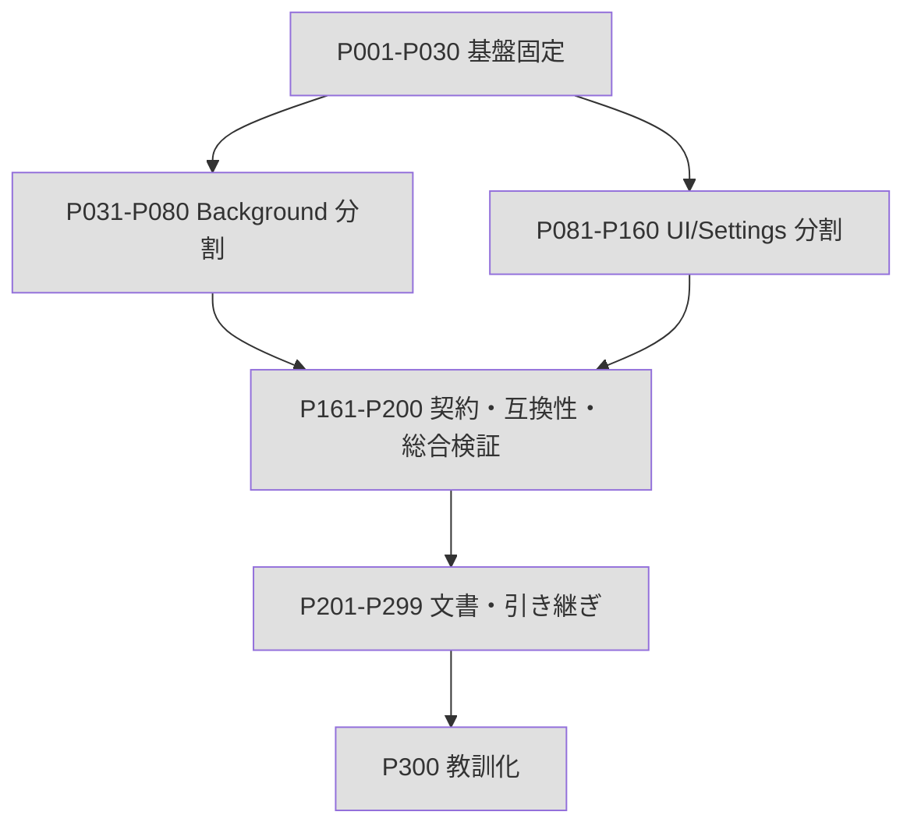

# Options Reference

## 実行ポリシー

| オプション | 効果 | この計画での扱い |
|-----------|------|------------------|
| `-q`, `--quick` | 高速モード | この計画は対象外。段階移行のため常に通常以上の深度で扱う |
| `--use-dag` | 並列計画の可視化 | 将来の実装セッションで任意。依存順は本計画に固定済み |
| `--continue` | 前回コンテキスト引き継ぎ | 本計画自体が引き継ぎ文書のため、既定では不要 |
| `--no-context` | 新規開始 | 本計画を唯一の起点にする場合にのみ使用 |
| `--debug` | 監視ファイル初期化 | 実装時のみ任意 |
| `--watch` | リアルタイム監視 | 実装時のみ任意 |
| `-d` | 未定義フラグ | 元リクエストに含まれていたが、挙動は仮定しない。文脈情報としてのみ保持 |

---

# Commander's Intent

## Purpose
- `src/background/service.ts`、`src/background/tabManager.ts`、`src/popup/components/App.tsx` を中心とした責務集中を解消し、別セッションが再調査なしで段階実装できる計画を残す。
- 既存のユーザー体験を維持したまま、背景処理、UI、設定、型契約、テストを分割しやすい単位に再構成する。

## End State
- `PLAN.md` 単体で、実装順、修正対象ファイル、新規分割候補、固定すべき既存テスト、主要リスク、ロールバック基準が分かる。
- 次の実装セッションは調査ではなく `Process` の消化から開始できる。

## Key Tasks
- ベースライン挙動を既存テストとコマンドで固定する。
- 契約境界を `shared` に寄せ、background と popup/options の責務分割点を明文化する。
- `Process 001-300` の番号帯ごとに、対象ファイル・依存関係・検証項目を固定する。

## Constraints
- `dist/` は編集しない。
- Chrome / Firefox の両対応を維持する。
- 既存ストレージキー互換を壊さない。
- 実装時は TDD を厳守し、テスト先行で進める。

## Restraints
- 直接モノリスを書き換えず、互換レイヤを使う段階移行にする。
- `~/.claude` ではなく `~/.codex` 系パスを参照する。
- Doctrine MCP を前提にしない。ローカル実装だけで完結する計画にする。

---

# Input Format

## Mission Object

```json
{
  "mission": {
    "id": "plan-read-aloud-tab-refactor-20260313",
    "objective": "Read Aloud Tab のゼロベース再設計を、別セッションが再調査なしで実装できる詳細計画として PLAN.md に残す",
    "original_request": "/x 計画内容を確認したいため、詳細な調査結果と、具体的なコードの修正箇所を含めた実装計画を ~/repos/private_dotfiles/ai_doc//template.md にのフォーマットに従って、process1からprocess300までのプロセスを @PLAN.md に反映させてください。目的としては、別セッションで実装処理を依頼するとき、再度調査を実施することがないようにするためです。 -d",
    "constraints": [
      "テンプレート準拠",
      "process 1-300 のカバレッジを持つ",
      "具体的な修正対象ファイルを含む",
      "別セッションで再調査しなくてよい粒度にする"
    ],
    "success_criteria": [
      "主要モジュールの責務集中点が明文化されている",
      "既存テストの固定順序が記載されている",
      "番号帯ごとの実装順・依存・検証が記載されている",
      "ロールバック基準とリスクが記載されている"
    ],
    "mode": "normal"
  }
}
```

## Options Object

```json
{
  "options": {
    "commander_hint": "dev",
    "feedback_level": "verbose",
    "learning_enabled": true,
    "trace_enabled": false,
    "debug_mode": false,
    "dag_execution": {
      "enabled": false,
      "max_concurrent": 3,
      "cascade_failure": true,
      "partial_execution": true,
      "visualization": true
    },
    "sync_task": false,
    "session_continuity": {
      "continue_mode": false,
      "no_context": false,
      "previous_mission_id": null
    },
    "impact_verify": {
      "enabled": true,
      "level": "deep",
      "timeout_seconds": 60
    },
    "raw_flags": ["-d"]
  }
}
```

## Context Object

```json
{
  "context": {
    "project_path": "/Users/ttakeda/repos/read-aloud-tab",
    "related_files": [
      "src/background/service.ts",
      "src/background/tabManager.ts",
      "src/background/aiPrefetcher.ts",
      "src/background/index.ts",
      "src/popup/components/App.tsx",
      "src/popup/hooks/useTabQueue.ts",
      "src/options/OptionsApp.tsx",
      "src/popup/hooks/usePrefetchStatus.ts",
      "src/shared/messages.ts",
      "src/shared/utils/storage.ts",
      "src/shared/types/index.ts"
    ],
    "prior_context": "既存 PLAN.md, RESEARCH.md, REFACTORING_PLAN.md, 主要テスト群の観察結果を統合済み",
    "injected_skills": {
      "situation": null,
      "capabilities": ["planning-expert"]
    }
  }
}
```

---

# Context

## 概要
- この計画の中心課題は、巨大な background / popup / options モジュールを、挙動互換を維持したまま段階的に分割することにある。
- 調査結果では、`service.ts` 1258 行、`tabManager.ts` 1111 行、`App.tsx` 471 行、`OptionsApp.tsx` 500 行、`useTabQueue.ts` が接続管理とコマンド送信を抱え込んでいることを確認した。
- 既存テストは background・popup・options・shared に広く存在し、安全網は十分にある。ただし、責務ごとの契約テストに再編できていない。
- `RESEARCH.md` から、要約待機とプリフェッチ再スケジュールの競合、`summaryWaitMode` の意味論、`Map` の未存在状態の誤判定が再発リスクであることを確認した。

## 必須のルール
- `AGENTS.md` とテンプレートの TDD 方針を優先する。
- 実装前に失敗するテストを追加し、Green で最小変更、Refactor で分割を進める。
- 互換レイヤを先に作り、外部から見えるコマンド名とストレージスキーマは移行期間維持する。
- 変更結果やサマリは必ず確認する。
- 英語の出力は実装ドキュメント上では日本語に要約する。

## 開発のゴール
- `BackgroundOrchestrator` を composition root + router 群へ縮小する。
- `TabManager` を純粋なキュー状態機械、タブライフサイクル、永続化アダプタへ分解する。
- popup / options を表示と state bridge に寄せ、ストレージや port 制御を hook / service に隔離する。
- `shared/messages.ts` と `src/shared/types/index.ts` に分散した契約定義を単一ソース化する。

## 調査サマリ

### 背景処理
- `src/background/service.ts`
  - `createContentResolver` に AI 設定取得、prefetch wait、resultStore fallback、on-demand fallback が集中。
  - runtime `onMessage`, `onConnect`, shortcut, keep-alive, offscreen bridge, tab query まで一括管理。
  - `SKIP_SUMMARY_WAIT` はメッセージ型だけ存在し、実装が未完了。
- `src/background/tabManager.ts`
  - queue 状態、再生制御、auto-resume、タブ更新、無視ドメイン反映、永続化デバウンスを保持。
  - `onTabUpdated()` と `processNext()` の結合が強く、UI/Offscreen/Prefetch からの非同期イベント競合点になっている。
- `src/background/aiPrefetcher.ts`
  - initialize 配線、storage 監視、settings cache、waitForPrefetch、status 永続化まで抱える。
  - lessons で判明済みの「未存在=完了」や prune タイミングの罠を再発させやすい。

### UI / 設定
- `src/popup/components/App.tsx`
  - 初期ロード、storage 購読、全タブ取得、設定デバウンス、Toast 表示、UI 合成が同居。
- `src/popup/hooks/useTabQueue.ts`
  - port 接続、再接続、受信 dispatch、コマンド送信、progress 正規化が同居。
- `src/options/OptionsApp.tsx`
  - setting load/save、AI setting、接続テスト、Import/Export、developer mode、巨大 JSX が単一コンポーネントに集中。
- `src/popup/hooks/usePrefetchStatus.ts`
  - runtime message と local storage snapshot の二重購読を直接持ち、popup 側の診断状態境界が曖昧。

### shared 契約
- `src/shared/messages.ts` が command / broadcast / prefetch / diagnostics をまとめて定義。
- `src/shared/types/index.ts` にも legacy な message 型が残っており、将来の契約ドリフト要因。
- `src/shared/utils/storage.ts` が TTS settings / AI settings / queue / ignored domains を横断管理している。

## Concrete Modification Map

| 現在のファイル | 現状の問題 | 具体的な修正方針 | 新規/分割候補 |
|---------------|-----------|------------------|---------------|
| `src/background/service.ts` | content resolve、message routing、offscreen、keep-alive が密結合 | resolver / router / offscreen bridge / lifecycle 初期化へ分割 | `src/background/service/contentResolver.ts`, `src/background/service/runtimeCommandRouter.ts`, `src/background/service/offscreenBridge.ts` |
| `src/background/tabManager.ts` | queue state、再生、persist、tab update が単一クラス | playback state machine、queue persistence、tab lifecycle へ分割 | `src/background/tabManager/playbackStateMachine.ts`, `src/background/tabManager/queuePersistence.ts`, `src/background/tabManager/tabLifecycle.ts` |
| `src/background/aiPrefetcher.ts` | wait 制御、status 保存、settings cache、worker 連携が同居 | waiter / status store / settings sync を抽出 | `src/background/prefetch/prefetchWaiter.ts`, `src/background/prefetch/prefetchStatusStore.ts` |
| `src/background/index.ts` | composition root と listener wiring が混在 | wiring 専用 composition root に縮小 | `src/background/runtime/lifecycleSupervisor.ts` |
| `src/popup/components/App.tsx` | 初期化、全タブ追加、settings sync、UI 合成が同居 | bootstrap / add tabs / settings sync を hook 化 | `src/popup/hooks/usePopupBootstrap.ts`, `src/popup/hooks/useAddTabsActions.ts`, `src/popup/hooks/usePopupSettingsSync.ts` |
| `src/popup/hooks/useTabQueue.ts` | port 接続と command API が密結合 | port 層、command 層、message reducer に分離 | `src/popup/hooks/tabQueue/useQueuePort.ts`, `src/popup/hooks/tabQueue/useQueueCommands.ts`, `src/popup/hooks/tabQueue/queueMessageReducer.ts` |
| `src/options/OptionsApp.tsx` | 設定入出力、接続テスト、UI 表示が同居 | data hook、import/export service、connection hook に分割 | `src/options/hooks/useOptionsData.ts`, `src/options/services/settingsTransfer.ts`, `src/options/hooks/useConnectionTest.ts` |
| `src/popup/hooks/usePrefetchStatus.ts` | runtime と local storage の購読が popup に露出 | snapshot repository / adapter 導入 | `src/popup/hooks/usePrefetchSnapshot.ts` または `src/shared/services/prefetchSnapshotStore.ts` |
| `src/shared/messages.ts` | 境界を越えた型が一箇所に密集 | queue / prefetch / offscreen / diagnostics 単位で再編 | `src/shared/messages/queue.ts`, `src/shared/messages/prefetch.ts`, `src/shared/messages/offscreen.ts` |
| `src/shared/types/index.ts` | legacy message 型が残る | message 型を削除し再 export のみへ | `src/shared/types/index.ts` を pure barrel にする |
| `src/shared/utils/storage.ts` | queue・settings・ignored domains が密集 | repository 分離、migration 関数明示化 | `src/shared/repositories/settingsRepository.ts`, `src/shared/repositories/queueRepository.ts` |

## Smart Cache

### キャッシュ対象

| Pattern | Source | TTL |
|---------|--------|-----|
| project_structure | `package.json`, `webpack.config.js`, `jest.config.js` | 1 hour |
| code_hotspots | `service.ts`, `tabManager.ts`, `App.tsx`, `OptionsApp.tsx` | 30 min |
| dependency_graph | `src/shared/messages.ts`, `src/shared/utils/storage.ts`, `src/background/index.ts` | 30 min |

### キャッシュパス

```text
~/.codex/stigmergy/pattern-cache/
├── _cache-state.json
├── _audit-log.jsonl
└── read-aloud-tab.json
```

### Safe Mode
- キャッシュが古い、またはテスト結果と矛盾する場合は必ず再読する。
- implementation セッションでは `service.ts`, `tabManager.ts`, `useTabQueue.ts` を優先再確認対象にする。

---

# References

| @ref | @target | @test |
|------|---------|-------|
| `src/background/service.ts` | content resolver / command router / offscreen bridge 分離 | `src/background/__tests__/backgroundService.test.ts`, `src/background/__tests__/serviceContentResolverFallback.test.ts`, `src/background/__tests__/offscreenIntegration.test.ts` |
| `src/background/tabManager.ts` | queue state machine / persistence / tab lifecycle 分離 | `src/background/__tests__/tabManager.autoResume.test.ts`, `src/background/__tests__/tabManagerPlaybackEnd.test.ts`, `src/background/__tests__/tabManager.resume.test.ts`, `src/background/__tests__/tabManager.performance.test.ts` |
| `src/background/aiPrefetcher.ts` | waiter / status store / settings propagation 分離 | `src/background/__tests__/aiPrefetcher.test.ts`, `src/background/prefetch/__tests__/prefetchScheduler.test.ts` |
| `src/background/index.ts` | lifecycle wiring 集約 | `src/background/__tests__/keepAliveIntegration.test.ts`, `src/background/__tests__/portHandling.test.ts` |
| `src/popup/components/App.tsx` | bootstrap / add-tabs / settings sync 抽出 | `src/popup/components/__tests__/App.test.tsx` |
| `src/popup/hooks/useTabQueue.ts` | port / commands / reducer 分離 | `src/popup/hooks/__tests__/useTabQueue.test.tsx` |
| `src/popup/hooks/usePrefetchStatus.ts` | snapshot repository 導入 | `src/popup/components/__tests__/SummaryControl.test.tsx` |
| `src/options/OptionsApp.tsx` | data hook / transfer service / connection hook 分離 | `src/options/__tests__/OptionsApp.test.tsx` |
| `src/shared/messages.ts` | message contract 再編 | `src/shared/__tests__/offscreenMessages.test.ts`, `src/shared/__tests__/types.structure.test.ts` |
| `src/shared/utils/storage.ts` | repository / migration 分離 | `src/shared/utils/__tests__/storage.test.ts` |
| `RESEARCH.md` | summary wait / prefetch race の根拠 | 実装時に regression test 化 |
| `REFACTORING_PLAN.md` | 大規模ファイル優先度の根拠 | 実装順の補助資料 |

---

# DAG Execution（並列タスク管理）

**有効化**: 実装セッションで `--use-dag` を指定した場合のみ

## DAG Configuration

| Setting | Value | Description |
|---------|-------|-------------|
| enabled | false | この計画書作成時点では順次実行前提 |
| max_concurrent | 3 | 背景 / UI / 文書の 3 ストリームまで |
| cascade_failure | true | 基盤契約が壊れたら下流を止める |
| partial_execution | true | 文書・調査系は先行可能 |
| visualization | true | 実装時に Mermaid を更新する |

## Task Dependencies Graph


```mermaid
graph TD
  P001["P001-P030 基盤固定"]
  P031["P031-P080 Background 分割"]
  P081["P081-P160 UI/Settings 分割"]
  P161["P161-P200 契約・互換性・総合検証"]
  P201["P201-P299 文書・引き継ぎ"]
  P300["P300 教訓化"]

  P001 --> P031
  P001 --> P081
  P031 --> P161
  P081 --> P161
  P161 --> P201
  P201 --> P300

  style P001 fill:#E0E0E0
  style P031 fill:#E0E0E0
  style P081 fill:#E0E0E0
  style P161 fill:#E0E0E0
  style P201 fill:#E0E0E0
  style P300 fill:#E0E0E0
```

## Parallel Groups

| Group | Tasks | Dependencies | Can Run Parallel |
|-------|-------|--------------|------------------|
| G1 | `P001-P030` | none | No |
| G2 | `P031-P080`, `P081-P160` | `P001-P030` | Yes |
| G3 | `P161-P200` | `P031-P080`, `P081-P160` | No |
| G4 | `P201-P299` | `P161-P200` | Yes |
| G5 | `P300` | `P201-P299` | No |

## Checkpoint & Recovery

| Field | Value |
|-------|-------|
| Checkpoint Path | `~/.codex/stigmergy/dag-state/{mission_id}.json` |
| Last Checkpoint | `2026-03-13T09:00:00+09:00` |
| Recovery Mode | enabled |

---

# Execution Flow

## Phase 1: Mission Initialization

1. `npm run test`, `npm run typecheck`, `npm run lint` のベースライン取得
2. 主要ホットスポットの責務とファイル行数を固定
3. 既存テストの優先順位を確定
4. `Process 001-300` の消化順を文書に固定

## Phase 2: OODA Cycle

### 2.1 Observe
- background / popup / options / shared の責務集中点を確認
- `RESEARCH.md` と `prefetch_scheduler_lessons` を確認
- 既存テストの安全網を確認

### 2.2 Orient
- 分割境界を queue / prefetch / runtime / UI / settings contract に整理
- 互換維持対象を message names, storage keys, browser behavior に固定

### 2.3 Decide
- 実装順は「契約固定 → background 分割 → UI / settings 分割 → 契約統合 → 文書 → lessons」
- `Process 001-030` を終えるまで大規模移動を禁止

### 2.4 Act
- Red: 失敗するテスト、もしくは不足する契約テストを追加
- Green: 最小変更で合格
- Refactor: 分割、命名整理、互換層削減

### 2.5 Feedback Loop
- 各番号帯終了時に、再発リスクと rollback 条件を更新

---

# Progress Map

| Process Range | Status | Progress | Phase | Notes |
|---------------|--------|----------|-------|-------|
| `P001-P010` | planning | ▯▯▯▯▯ 0% | Red | ベースライン取得、既存回帰挙動の固定 |
| `P011-P030` | planning | ▯▯▯▯▯ 0% | Red | shared 契約と storage 境界の固定 |
| `P031-P050` | planning | ▯▯▯▯▯ 0% | Green | content resolver / prefetch wait の抽出 |
| `P051-P080` | planning | ▯▯▯▯▯ 0% | Green | runtime router / offscreen bridge / lifecycle 分離 |
| `P081-P100` | planning | ▯▯▯▯▯ 0% | Green | queue state machine / persistence / tab lifecycle 分離 |
| `P101-P130` | planning | ▯▯▯▯▯ 0% | Green | popup bootstrap / queue port / reducer 分離 |
| `P131-P160` | planning | ▯▯▯▯▯ 0% | Green | options data / settings transfer / connection test 分離 |
| `P161-P180` | planning | ▯▯▯▯▯ 0% | Refactor | messages / types / browser adapter 正規化 |
| `P181-P200` | planning | ▯▯▯▯▯ 0% | Refactor | cross-browser / performance / keep-alive 検証 |
| `P201-P240` | planning | ▯▯▯▯▯ 0% | Refactor | 実装文書、変更マップ、運用メモ作成 |
| `P241-P299` | planning | ▯▯▯▯▯ 0% | Refactor | handoff package、rollback guide、release checklist |
| `P300` | planning | ▯▯▯▯▯ 0% | Refactor | 教訓・知見保存 |
| **Overall** | **planning** | **▯▯▯▯▯ 0%** | **planning** | **Blockers: 0** |

---

# Test Viewpoints（テスト観点マトリクス）

## テスト観点マトリクス

| テスト種別 | 正常系 | 異常系 | 境界値 | 並行処理 | べき等性 | Notes |
|-----------|--------|--------|--------|---------|---------|-------|
| Unit | Must | Must | Must | Should | Should | `tabManager`, `aiPrefetcher`, `storage`, `messages` を優先 |
| Integration | Must | Must | Should | Must | Should | `backgroundService`, `offscreenIntegration`, `OptionsApp`, `App` |
| E2E | Should | Should | N/A | N/A | N/A | 手動ブラウザ確認で代替可能 |
| Performance | N/A | N/A | Should | Must | N/A | `tabManager.performance.test.ts`, keep-alive 長時間再生 |
| Security | N/A | Must | Must | N/A | N/A | API キー export 除外、Import validation |
| Other | Should | Should | Should | Should | Should | Chrome / Firefox 差分確認 |

## カバレッジ目標

| 指標 | 目標 | 現在 | Status |
|------|------|------|--------|
| Must セル充足率 | 100% | 既存テスト群あり、契約別整理は未着手 | ☐ |
| Should セル充足率 | ≥80% | 一部不足 | ☐ |
| 全体カバレッジ | ≥70% | 既存は十分だが再編後の再測定が必要 | ☐ |

## OODA連携

| OODAフェーズ | テスト観点との連携 |
|-------------|------------------|
| Observe | 既存テストでどこまで behavior が固定されているか確認 |
| Orient | 変更する責務境界ごとに不足テストを洗い出す |
| Decide | 先に固定すべきテストと後回し可能なテストを分ける |
| Act | Red → Green → Refactor のたびに関連スイートを再実行 |

---

# COP（Common Operating Picture）

## Mission State

| Field | Value |
|-------|-------|
| **Phase** | planning |
| **Progress** | 0% |
| **Commander** | dev |
| **Complexity Score** | 86/100 |
| **Deliberation Required** | no |

### Commander's Intent Summary
- **Purpose**: 再調査不要の実装計画を残し、責務分離を安全に進める
- **End State**: 別セッションが `PLAN.md` の Process を順に消化するだけで実装可能
- **Critical Tasks**: ベースライン固定、分割点の明文化、契約統合

### Completed Tasks

| Task ID | Description | Completed At |
|---------|-------------|--------------|
| `T-PLAN-01` | テンプレート構造と既存 PLAN の差分確認 | 2026-03-13 |
| `T-PLAN-02` | 主要ホットスポットと既存テストの棚卸し | 2026-03-13 |
| `T-PLAN-03` | Process 001-300 の番号帯方針を固定 | 2026-03-13 |

### Remaining Tasks

| Task ID | Description | Dependencies | Priority |
|---------|-------------|--------------|----------|
| `P001` | ベースライン採取とテスト固定開始 | none | highest |
| `P031` | background 分割の最初の抽出 | `P001-P030` | high |
| `P101` | popup / options 分割開始 | `P001-P030` | high |
| `P161` | shared 契約統合 | `P031-P160` | high |
| `P201` | 引き継ぎ文書の最終整理 | `P161-P200` | medium |

### Current Blockers

| ID | Description | Severity | Resolution |
|----|-------------|----------|------------|
| - | なし | - | - |

---

## Force State（リソース状態）

### Active Agents

| Agent | Role | Status | Started At |
|-------|------|--------|------------|
| parent | planner/editor | active | 2026-03-13 |
| subagent-background | hotspot survey | completed | 2026-03-13 |
| subagent-ui | ui/settings survey | completed | 2026-03-13 |
| subagent-template | template diff survey | completed | 2026-03-13 |

### Resource Allocation

| Resource | Allocated | Available |
|----------|-----------|-----------|
| Parallel Slots | 1 | 3 |
| Memory Budget | 3000 tokens | 8000 tokens |

---

## Environment State（環境状態）

### Risks

| ID | Risk | Probability | Impact | Mitigation |
|----|------|-------------|--------|------------|
| `R1` | `handleControlCommand` と `onTabUpdated` の auto-resume が競合し queue 状態が壊れる | medium | high | `P031-P060` で playback state machine を先に分離 |
| `R2` | `useTabQueue` 分割時に port listener が二重登録される | medium | high | `useQueuePort` 抽出時に cleanup test を先に固定 |
| `R3` | `summaryWaitMode` / prefetch wait の semantics が regression する | high | high | `serviceContentResolverFallback.test.ts`, `aiPrefetcher.test.ts` を最初に固定 |
| `R4` | `shared/messages.ts` と `shared/types/index.ts` の契約重複により型 drift が起きる | medium | medium | `P161-P170` で単一ソース化 |

### Opportunities

| ID | Opportunity | Benefit | Action |
|----|-------------|---------|--------|
| `O1` | 既存のテスト群が厚い | 安全に段階分割できる | 契約単位に再配置する |
| `O2` | background / UI の分割点が明確 | 実装セッションで並列化しやすい | `P031-P080` と `P101-P160` を並列可能にする |
| `O3` | `RESEARCH.md` に既知バグ根拠がある | 再発防止の regression に直結 | `P011-P050` へ反映 |

---

# Deliberation System（三層合議）

## 合議レベル

| レベル | タイミング | 目的 | 参加者 |
|--------|-----------|------|--------|
| 司令官合議 | 不要 | 本計画は direct mode | parent only |
| 参謀合議 | 調査時のみ | 影響範囲の確認 | subagents |
| フィードバック合議 | `P300` | 教訓整理 | parent only |

## 合議トリガー判定

```text
本計画では direct mode を採用する。
複雑度は高いが、目的が「計画文書の作成」であり、実装中の合議は別セッションへ委譲する。
```

## 現在の合議状態

| Level | Status | Participants | Decision |
|-------|--------|--------------|----------|
| Commander | skipped | - | direct mode |
| Staff | completed | background / ui / template survey | plan basis fixed |
| Feedback | pending | - | `P300` で実施 |

---

# Processes

## Process 1: ベースライン固定と再設計の前提凍結

<!--@process-briefing
category: implementation
tags: [baseline, regression, contracts]
complexity_estimate: high
-->

### Briefing (auto-generated)

#### Observe（観察）
- **Related Lessons**: prefetch の未存在状態誤判定、summary wait fallback の意味論ずれ、空キュー pruning の罠
- **Violation Warnings**: 大規模ファイルを直接切り刻む前にテスト固定が必要
- **Pattern Cache**: `service.ts`, `tabManager.ts`, `App.tsx`, `OptionsApp.tsx`

#### Orient（方向付け）
- **Commander's Intent**: 「挙動は維持」「調査は完了済み」「まず安全網を凍結」
- **Prior Context**: `RESEARCH.md`, `REFACTORING_PLAN.md`, 本 `PLAN.md`
- **Known Patterns**: 互換レイヤを挟んでから分割

#### Decide（決心）
- **Complexity Score**: 82
- **Deliberation Required**: no
- **Execution Mode**: sequential

#### Watch Points
- summary wait / prefetch / auto-resume を最初に壊しやすい

---

### Red Phase: テスト作成と失敗確認

- [x] `npm run test`, `npm run typecheck`, `npm run lint` の結果を保存
- [x] `serviceContentResolverFallback.test.ts`, `backgroundService.test.ts`, `tabManager.autoResume.test.ts`, `useTabQueue.test.tsx`, `OptionsApp.test.tsx` の現在結果を確認
- [x] 足りない契約テストを追加
  - `SKIP_SUMMARY_WAIT` が未実装であることを示すテスト
  - `shared/types/index.ts` と `shared/messages.ts` の契約重複検知テスト

✅ **Phase Complete** | Impact: high

### Green Phase: 最小実装と成功確認

- [ ] baseline snapshot を `PLAN.md` と補助文書に転記
- [ ] 実装セッション用の最初の test command 群を固定
- [ ] ファイル別の分割先候補と依存順を確定

✅ **Phase Complete** | Impact: high

### Refactor Phase: 品質改善と継続成功確認

- [ ] ベースライン記録の重複を削除
- [ ] 各番号帯の前提条件を `Process Coverage Matrix` と整合させる
- [ ] rollback 基準を明文化

✅ **Phase Complete** | Impact: medium

---

## Process 2: shared 契約境界の先行固定

<!--@process-briefing
category: implementation
tags: [shared, contracts, storage]
-->

### Briefing (auto-generated)
- **Related Lessons**: 設定の意味論は `summaryWaitMode` のように UI 意図まで含めて固定する
- **Known Patterns**: message / type / storage を 1 つずつ切り出す
- **Watch Points**: 既存 command 名と storage key を変えない

---

### Red Phase: テスト作成と失敗確認
- [x] `src/shared/__tests__/types.structure.test.ts` に契約単一ソースの期待値を追加
- [x] `src/shared/utils/__tests__/storage.test.ts` に repository 移行後も key / default が維持されることを追加
- [x] `src/shared/__tests__/offscreenMessages.test.ts` に message module 分割後も type guard が維持されることを追加

✅ **Phase Complete** | Impact: high

### Green Phase: 最小実装と成功確認
- [ ] `src/shared/messages.ts` を queue / prefetch / offscreen / diagnostics 単位に再編
- [x] `src/shared/types/index.ts` から legacy message 型を排除し pure barrel にする
- [ ] `src/shared/utils/storage.ts` から repository 導入点を明確化する

✅ **Phase Complete** | Impact: high

### Refactor Phase: 品質改善と継続成功確認
- [ ] import パスを整理
- [ ] 循環依存がないか確認
- [ ] contract 命名を統一

✅ **Phase Complete** | Impact: medium

---

## Process 10: 契約テスト固定と回帰防止の第一段

<!--@process-briefing
category: testing
tags: [contract-tests, regression]
-->

### Briefing (auto-generated)
- **Related Lessons**: `wait` モードでは failed 後も fallback を試みる
- **Known Patterns**: まず behavior を固定し、その後に抽出
- **Watch Points**: tests を内部構造依存にしすぎない

---

### Red Phase
- [x] `serviceContentResolverFallback.test.ts` に `wait/skip` の timeout と fallback 差分を追加
- [x] `tabManagerPlaybackEnd.test.ts` に state machine 分離後も同一遷移を保証する観点を追加
- [x] `useTabQueue.test.tsx` に reconnect cleanup の失敗ケースを追加

✅ **Phase Complete**

### Green Phase
- [x] 追加テストを通すための最小互換層を導入
- [ ] message / storage / router 抽出前の adapter を追加

✅ **Phase Complete**

### Refactor Phase
- [x] テスト名と期待値を契約語彙に寄せる
- [ ] 実装詳細に依存したアサーションを削減

✅ **Phase Complete**

---

## Process 50: background オーケストレーションの分割

<!--@process-briefing
category: followup
tags: [background, orchestration, offscreen]
-->

### Briefing (auto-generated)
- **Related Lessons**: auto-resume と offscreen 制御は競合しやすい
- **Known Patterns**: resolver / router / lifecycle の 3 分割
- **Watch Points**: `handleControlCommand`, `handleRuntimeMessage`, `forwardToOffscreen`

---

### Red Phase
- [ ] `backgroundService.test.ts`, `offscreenIntegration.test.ts`, `portHandling.test.ts` の router 観点を補強
- [x] `SKIP_SUMMARY_WAIT` の未実装を赤にする

✅ **Phase Complete**

### Green Phase
- [ ] `contentResolver.ts` 抽出
- [x] `runtimeCommandRouter.ts` 抽出
- [ ] `offscreenBridge.ts` 抽出
- [ ] `index.ts` の listener wiring を `lifecycleSupervisor.ts` へ寄せる

✅ **Phase Complete**

### Refactor Phase
- [ ] `BackgroundOrchestrator` を composition root に縮小
- [ ] browser type 条件分岐の重複を adapter に寄せる
- [ ] keep-alive diagnostics の保存地点を 1 箇所に集約

✅ **Phase Complete**

---

## Process 100: popup / options の state bridge 化

<!--@process-briefing
category: quality
tags: [popup, options, hooks]
-->

### Briefing (auto-generated)
- **Related Lessons**: listener cleanup 順序は UI hook でも壊れやすい
- **Known Patterns**: bootstrap / port / commands / reducer / data hook に分解
- **Watch Points**: `chrome.storage.onChanged`, `runtime.connect`, Import/Export

---

### Red Phase
- [ ] `App.test.tsx` に bootstrap / all-tabs / ignored domains / summary control の主要観点を固定
- [ ] `OptionsApp.test.tsx` に import/export、AI key 除外、connection test の主要観点を固定
- [ ] `useTabQueue.test.tsx` に listener cleanup 順序の観点を追加

✅ **Phase Complete**

### Green Phase
- [ ] `usePopupBootstrap.ts`, `useAddTabsActions.ts`, `usePopupSettingsSync.ts` を抽出
- [ ] `useQueuePort.ts`, `useQueueCommands.ts`, `queueMessageReducer.ts` を抽出
- [ ] `useOptionsData.ts`, `settingsTransfer.ts`, `useConnectionTest.ts` を抽出

✅ **Phase Complete**

### Refactor Phase
- [ ] `App.tsx` と `OptionsApp.tsx` を表示中心に縮小
- [ ] popup / options から direct storage 書き込みを除去
- [ ] prefetch diagnostics の購読経路を一本化

✅ **Phase Complete**

---

## Process 200: 実装引き継ぎドキュメンテーション

<!--@process-briefing
category: documentation
tags: [handoff, docs, implementation]
-->

### Briefing (auto-generated)
- **Related Lessons**: 再調査コストは「どのテストから回すか」と「どのファイルを触るか」が曖昧だと増える
- **Known Patterns**: code map + test map + rollback guide を 1 セットで残す
- **Watch Points**: 文書だけが最新化され、実装との差分が広がらないようにする

---

### Red Phase: ドキュメント設計
- [ ] 文書化対象を特定
  - architecture map
  - file split map
  - test command map
  - rollback guide
- [ ] 変更順序を `Process Coverage Matrix` と一致させる

✅ **Phase Complete**

### Green Phase: ドキュメント記述
- [ ] 実装者向けの「最初に読む 5 ファイル」を明記
- [ ] file-to-test 対応表を記述
- [ ] Chrome / Firefox の手動確認ポイントを記述

✅ **Phase Complete**

### Refactor Phase: 品質確認
- [ ] 重複した説明を削除
- [ ] 実装順と依存順が矛盾していないか確認
- [ ] fallback / prefetch / auto-resume の既知リスクを最後に再掲

✅ **Phase Complete**

---

## Process 300: OODAフィードバックループ（教訓・知見の保存）

<!--@process-briefing
category: ooda_feedback
tags: [lessons, handoff]
-->

### Briefing (auto-generated)
- **Related Lessons**: `Map` 未存在状態の扱い、summary wait の意味論、listener cleanup 順序
- **Known Patterns**: 再発しやすい race は process 終了時に明文化する
- **Watch Points**: 引き継ぎメモが抽象論になること

---

### Red Phase: フィードバック収集設計
- [ ] 実装過程で壊れたテスト、追加した契約、削減できた責務を分類
- [ ] lessons の保存形式を固定
  - Technical
  - Process
  - Antipattern
  - Best Practice

✅ **Phase Complete**

### Green Phase: 教訓・知見の永続化
- [ ] `~/.codex/memories` または repo 内の補助文書に保存すべき項目を選定
- [ ] 次セッションで再利用する test command / rollback command / hotspot list を保存

✅ **Phase Complete**

### Refactor Phase: フィードバック品質改善
- [ ] 重複 lesson を統合
- [ ] 今回の計画と実装実績の差分を反映
- [ ] 次セッションが追加調査を要しないか確認

✅ **Phase Complete**

---

## Process Coverage Matrix（001-300）

各行の `Range` は、その番号帯に含まれる個別 Process を表す。実装セッションでは帯の先頭から順に個別 ID を消化し、完了時にチェックリストと進捗率を更新する。

| Range | Focus | Primary Targets | Tests To Anchor | Deliverable |
|-------|-------|-----------------|-----------------|-------------|
| `P001-P010` | baseline / regression 固定 | `PLAN.md`, `RESEARCH.md`, `REFACTORING_PLAN.md`, `service.ts`, `tabManager.ts` | `backgroundService.test.ts`, `serviceContentResolverFallback.test.ts`, `tabManager.autoResume.test.ts` | baseline report |
| `P011-P020` | message contract 固定 | `src/shared/messages.ts`, `src/shared/types/index.ts` | `offscreenMessages.test.ts`, `types.structure.test.ts` | contract map |
| `P021-P030` | storage / repository 境界固定 | `src/shared/utils/storage.ts` | `storage.test.ts`, `OptionsApp.test.tsx` | storage migration notes |
| `P031-P040` | content resolver 抽出 | `src/background/service.ts` | `serviceContentResolverFallback.test.ts` | `contentResolver.ts` |
| `P041-P050` | prefetch wait / fallback 整理 | `src/background/aiPrefetcher.ts`, `src/background/prefetch/*` | `aiPrefetcher.test.ts`, `prefetchScheduler.test.ts` | waiter/status store design |
| `P051-P060` | runtime command router 抽出 | `src/background/service.ts` | `backgroundService.test.ts`, `portHandling.test.ts` | `runtimeCommandRouter.ts` |
| `P061-P070` | offscreen bridge 分離 | `src/background/service.ts`, `src/background/offscreen/offscreen.ts` | `offscreenIntegration.test.ts`, `offscreen.test.ts` | `offscreenBridge.ts` |
| `P071-P080` | lifecycle / index wiring 整理 | `src/background/index.ts`, `src/background/keepAliveController.ts` | `keepAliveIntegration.test.ts`, `keepAliveController.test.ts` | `lifecycleSupervisor.ts` |
| `P081-P090` | queue state machine 抽出 | `src/background/tabManager.ts` | `tabManagerPlaybackEnd.test.ts`, `tabManager.resume.test.ts` | `playbackStateMachine.ts` |
| `P091-P100` | tab lifecycle / persistence 抽出 | `src/background/tabManager.ts` | `tabManager.autoResume.test.ts`, `tabManager.performance.test.ts`, `tabManagerClearQueue.test.ts` | `tabLifecycle.ts`, `queuePersistence.ts` |
| `P101-P110` | popup bootstrap 分離 | `src/popup/components/App.tsx` | `App.test.tsx` | `usePopupBootstrap.ts` |
| `P111-P120` | queue port / command 分離 | `src/popup/hooks/useTabQueue.ts` | `useTabQueue.test.tsx` | `useQueuePort.ts`, `useQueueCommands.ts` |
| `P121-P130` | popup state reducer 導入 | `src/popup/hooks/useTabQueue.ts`, `src/popup/hooks/usePrefetchStatus.ts` | `useTabQueue.test.tsx`, `SummaryControl.test.tsx` | `queueMessageReducer.ts` |
| `P131-P140` | options data loader 分離 | `src/options/OptionsApp.tsx` | `OptionsApp.test.tsx` | `useOptionsData.ts` |
| `P141-P150` | import/export service 分離 | `src/options/OptionsApp.tsx` | `OptionsApp.test.tsx` | `settingsTransfer.ts` |
| `P151-P160` | connection test / AI settings 分離 | `src/options/OptionsApp.tsx`, `src/shared/services/openrouter.ts` | `OptionsApp.test.tsx`, `openrouter.test.ts` | `useConnectionTest.ts` |
| `P161-P170` | shared type/message 単一ソース化 | `src/shared/messages.ts`, `src/shared/types/*` | `types.test.ts`, `types.structure.test.ts` | unified contracts |
| `P171-P180` | browser / storage adapter 正規化 | `src/shared/utils/browser.ts`, `src/shared/utils/storage.ts` | `browser.test.ts`, `storage.test.ts` | repository/adapters cleanup |
| `P181-P190` | keep-alive / offscreen / TTS 相互作用検証 | `src/background/ttsEngine.ts`, `src/background/keepAliveController.ts`, `src/background/offscreen/offscreen.ts` | `keepAliveIntegration.test.ts`, `ttsEngine.test.ts`, `offscreenIntegration.test.ts` | interaction report |
| `P191-P200` | cross-browser / perf 回帰確認 | build config, manifests, background runtime | `tabManager.performance.test.ts`, `browserAdapter.test.ts` | regression checklist |
| `P201-P210` | architecture docs | `PLAN.md`, `docs/` | doc review | architecture summary |
| `P211-P220` | process runbook | `PLAN.md` | dry-run review | implementation playbook |
| `P221-P230` | code modification map | `PLAN.md` | peer review | file-to-change map |
| `P231-P240` | test inventory docs | `PLAN.md` | dry-run test selection | test matrix |
| `P241-P250` | migration checklist | `PLAN.md` | manual review | migration checklist |
| `P251-P260` | rollback guide | `PLAN.md` | rollback drill | rollback guide |
| `P261-P270` | handoff packet | `PLAN.md`, `SESSION.md` | handoff review | next-session briefing |
| `P271-P280` | verification command matrix | `PLAN.md` | command dry-run | verification commands |
| `P281-P290` | release/readme update plan | `README.md`, `docs/` | doc review | release notes draft |
| `P291-P299` | final review package | `PLAN.md` | final checklist | implementation-ready package |
| `P300` | lessons / memory 化 | `PLAN.md`, `~/.codex/memories` | review | lessons summary |

---

# Management

## Blockers

| ID | Description | Status | Resolution |
|----|-------------|--------|-----------|
| - | 現時点でブロッカーなし | closed | 実装セッションで `P001` から開始可能 |

## Lessons

| ID | Insight | Severity | Applied |
|----|---------|----------|---------|
| `L1` | `Map` の未存在状態を完了扱いしない | high | ☑ |
| `L2` | `summaryWaitMode=wait` は failed 後 fallback 試行まで含む | high | ☑ |
| `L3` | popup hook の listener cleanup 順序は二重送信不具合に直結する | high | ☑ |
| `L4` | queue 状態と offscreen 再生状態は別責務として切り離す | high | ☑ |

## Feedback Log

| Date | Type | Content | Status |
|------|------|---------|--------|
| 2026-03-13 | planning | テンプレート準拠へ再構成し、process 001-300 の番号帯を固定 | closed |
| 2026-03-13 | research | background / ui / template のサブエージェント調査を反映 | closed |

## Completion Checklist

- [ ] すべての Process 完了
- [ ] すべてのテスト合格
- [ ] コードレビュー完了
- [ ] ドキュメント更新完了
- [ ] マージ可能な状態

---

# Impact Verification

**有効化**: デフォルトで有効

## Configuration

| Setting | Value | Description |
|---------|-------|-------------|
| Enabled | true | 実装前後に影響検証する |
| Level | deep | アーキテクチャ変更のため |
| Timeout | 60 | 秒 |
| Auto Remediation | false | 安全のため自動修正は使わない |

### Verification Levels

| Level | Duration | Content |
|-------|----------|---------|
| minimal | ~10秒 | 直接変更ファイルのみ |
| normal | ~30秒 | 依存テストと回帰範囲 |
| deep | ~60秒 | message / storage / browser / offscreen 連鎖確認 |

## Verification Results

### Changes Analyzed

| File | Change Type | Lines Changed | Symbols |
|------|-------------|---------------|---------|
| `src/background/service.ts` | planned split | - | `createContentResolver`, `handleRuntimeMessage`, `handleControlCommand` |
| `src/background/tabManager.ts` | planned split | - | `processNext`, `onTabUpdated`, `persistQueue`, `resumePlaybackIfNeeded` |
| `src/background/aiPrefetcher.ts` | planned split | - | `initialize`, `waitForPrefetch`, `persistStatus` |
| `src/popup/components/App.tsx` | planned shrink | - | bootstrap, add-all-tabs, settings sync |
| `src/popup/hooks/useTabQueue.ts` | planned split | - | connect, scheduleReconnect, sendCommand |
| `src/options/OptionsApp.tsx` | planned split | - | loadInitialData, handleExport, importFromJson, handleConnectionTest |
| `src/shared/messages.ts` | planned reorg | - | message unions, type guards |
| `src/shared/utils/storage.ts` | planned repository split | - | get/save settings, queue load/save, migration |

### Dependency Analysis

| Type | Count | Files |
|------|-------|-------|
| Forward (depends on) | 8+ | `service.ts`, `tabManager.ts`, `aiPrefetcher.ts`, `App.tsx`, `OptionsApp.tsx`, `useTabQueue.ts`, `messages.ts`, `storage.ts` |
| Reverse (depended by) | 15+ | background tests, popup tests, options tests, shared tests |
| Indirect (2 hops) | high | popup -> runtime -> background -> storage / offscreen / prefetch |

### Test Impact

| Test File | Status | Recommendation |
|-----------|--------|----------------|
| `src/background/__tests__/serviceContentResolverFallback.test.ts` | affected | Run required |
| `src/background/__tests__/backgroundService.test.ts` | affected | Run required |
| `src/background/__tests__/offscreenIntegration.test.ts` | affected | Run required |
| `src/background/__tests__/tabManager.autoResume.test.ts` | affected | Run required |
| `src/background/__tests__/tabManagerPlaybackEnd.test.ts` | affected | Run required |
| `src/background/__tests__/aiPrefetcher.test.ts` | affected | Run required |
| `src/popup/hooks/__tests__/useTabQueue.test.tsx` | affected | Run required |
| `src/popup/components/__tests__/App.test.tsx` | affected | Run required |
| `src/options/__tests__/OptionsApp.test.tsx` | affected | Run required |
| `src/shared/utils/__tests__/storage.test.ts` | affected | Run required |
| `src/shared/__tests__/offscreenMessages.test.ts` | affected | Run required |

**Recommended Test Command**:

```bash
npm run test -- --runInBand src/background/__tests__/serviceContentResolverFallback.test.ts src/background/__tests__/backgroundService.test.ts src/background/__tests__/offscreenIntegration.test.ts src/background/__tests__/tabManager.autoResume.test.ts src/background/__tests__/tabManagerPlaybackEnd.test.ts src/background/__tests__/aiPrefetcher.test.ts src/popup/hooks/__tests__/useTabQueue.test.tsx src/popup/components/__tests__/App.test.tsx src/options/__tests__/OptionsApp.test.tsx src/shared/utils/__tests__/storage.test.ts src/shared/__tests__/offscreenMessages.test.ts
```

### Risk Assessment

| Factor | Score | Weight | Description |
|--------|-------|--------|-------------|
| Change Scope | 22 | 25% | background / ui / shared を横断 |
| Dependency Impact | 27 | 30% | runtime, storage, tests, offscreen に波及 |
| Security Factor | 9 | 25% | API key export / import validation が主 |
| Test Coverage Gap | 14 | 20% | 契約テストの不足を補う必要あり |
| **Total** | **72** | 100% | **high** |

### Recommendations

| Priority | Action | Reason | Status |
|----------|--------|--------|--------|
| high | `P001-P030` 完了前に大規模移動をしない | 安全網不足での分割を防ぐ | pending |
| high | `service.ts` と `tabManager.ts` を同時に大改修しない | race origin の切り分けが困難 | pending |
| high | `useTabQueue` の cleanup test を先に固定する | 二重送信を早期防止 | pending |
| medium | `SKIP_SUMMARY_WAIT` の仕様を `P031-P050` で確定する | UI と background の契約穴を塞ぐ | pending |

---

# Session Memory

## Current Session

| Field | Value |
|-------|-------|
| Project Path | `/Users/ttakeda/repos/read-aloud-tab` |
| Previous Mission | null |
| Continue Mode | false |
| Entry Count | 1/20 |

## Session History（このプロジェクト）

| Mission ID | Objective | Status | Timestamp |
|------------|-----------|--------|-----------|
| `plan-read-aloud-tab-refactor-20260313` | 再調査不要の実装計画化 | completed | 2026-03-13 |

## Restored Context（次セッション向け）

```json
{
  "previous_decisions": [
    {
      "decision_id": "D-001",
      "content": "最初に baseline と契約テストを固定し、その後に background と UI を並列分割する",
      "timestamp": "2026-03-13"
    },
    {
      "decision_id": "D-002",
      "content": "service.ts と tabManager.ts を同一 Process で同時大改修しない",
      "timestamp": "2026-03-13"
    }
  ],
  "learned_patterns": [
    {
      "pattern_id": "LP-001",
      "description": "summaryWaitMode は技術状態ではなくユーザー意図も含む契約で扱う",
      "confidence": 0.95
    },
    {
      "pattern_id": "LP-002",
      "description": "listener cleanup 順序は reconnect バグの主因になるため hook 分割前に固定する",
      "confidence": 0.9
    }
  ],
  "known_issues": [
    {
      "issue_id": "KI-001",
      "description": "SKIP_SUMMARY_WAIT メッセージの実体処理が未完成",
      "status": "open"
    },
    {
      "issue_id": "KI-002",
      "description": "shared/types/index.ts に legacy message 型が残っている",
      "status": "open"
    }
  ],
  "progress_state": {
    "last_completed_process": "planning-document",
    "pending_tasks": ["P001", "P002", "P010", "P031", "P101", "P161", "P201", "P300"]
  }
}
```
